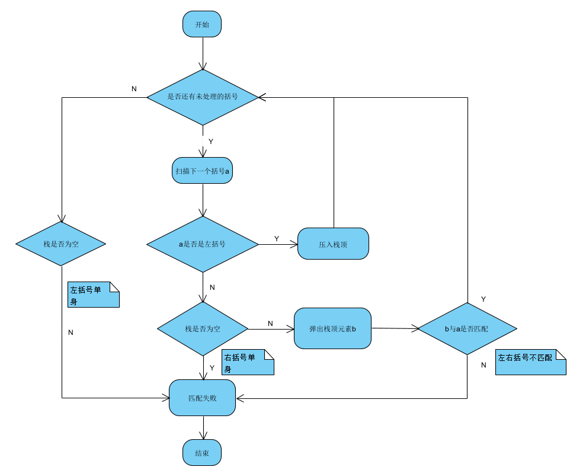
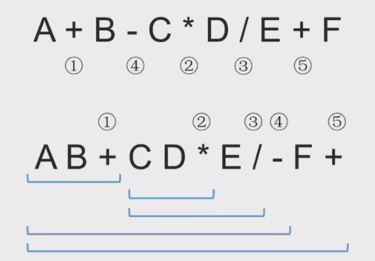

# 括号匹配问题

$$
(()())
$$

​		最后出现的左括号会最先被匹配**（LIFO）**，与栈的特性相符。

### 算法具体流程：

1. 依次扫描所有字符，遇到左括号入栈，遇到右括号谈出栈顶元素检查是否与这个右括号相匹配；
2. 匹配失败的情况：左括号或右括号单身（扫描完栈还未空）；左右括号不匹配。

# 栈在表达式求值的问题

​		算数表达式由**操作数**、**运算符**、**界限符**组成。

|            |       |           |               |
| ---------- | ----- | --------- | ------------- |
| 中缀表达式 | a + b | a + b - c | a + b - c * d |
| 前缀表达式 | +ab   | a + b - c | -+ab*cd       |
| 后缀表达式 | ab+   | ab+c      | ab+cd*-       |

### 后缀表达式（更重要）

1. **中缀转后缀的方式：**

- 确定中缀表达式中各个运算符的运算顺序；
- 选择下一个运算符，按照**【左操作数  右操作数  运算符】**的方式组合成一个新的操作数；
- 若还有运算符未被处理，继续第二步。

**注意：**

- 运算原则：先乘除后加减；
- **左优先原则：**只要左边还有运算符能够计算，就优先算左边的（可以保证运算顺序唯一，即算法的确定性）。

2. **后缀表达式的手算方式：**

​		从左往右扫描，每遇到一个运算符，就让运算符前面最近的两个操作数执行对应的运算，合并为一个操作数。

3. **使用栈实现后缀表达式的计算：**

   - 从左往右扫描下一个元素，直到处理完所有的元素；

   - 若扫描到操作数则压入栈，并回到第一步，否则执行第三步；

   - 若扫描到运算符，则弹出两个栈顶元素，执行相应的运算，并且将运算结果压回栈顶，最后继续第一步。

     

4. **计算机中中缀表达式转后缀表达式的方式：**

   从左到右处理各个元素，直到中缀表达式的末尾

   - 遇到操作数，直接加入后缀表达式；
   - 遇到界限符，遇到“（”直接入栈，遇到“）”会依次弹出栈内运算符并加入后缀表达式中，直到弹出“（”为止，但是“（”本身不会加入后缀表达式；
   - 遇到运算符，依次弹出栈中优先级高于或等于当前运算符的所有运算符（*/大于+-），并加入后缀表达式，直到遇到“（”或者栈空为止，最后再把当前扫描到的运算符入栈。

### 前缀表达式

1. 中缀转前缀的方式：
   - 确定中缀表达式中各个运算符的运算顺序；
   - 选择下一个运算符，按照**【运算符 左操作数  右操作数】**的方式组合成一个新的操作数；
   - 若还有运算符未被处理，继续第二步。

**注意：**

​		**右优先原则：**只要右边还有运算符能够计算，就优先算右边的（可以保证运算顺序唯一，即算法的确定性）。

2. **使用栈实现前缀表达式的计算：**

   与后缀表达式正好相反。

**易错： ** **前缀表达式**中先出栈的是**左操作数**，而**后缀表达式**中先出栈的是**右操作数**。

### 中缀表达式使用栈的计算

1. 初始化两个栈：**操作数栈**和**运算符栈**；
2. 若扫描到**操作数**，则压入操作数栈；
3. 若扫描到**运算符**或者**界限符**，则按照**中缀转后缀相同的逻辑**压入运算符栈（若弹出运算符，则操作数栈也需要弹出两个栈顶元素并执行相应的运算，之后把结果压回操作数栈）。

# 栈在递归中的运用

1. 特点：最后被调用的最先执行结束（LIFO）。

   

2. 递归步骤：

   - 每进入一层递归，就将递归调用所需的信息压入栈顶；

   - 每退出一层递归，就从栈顶弹出相应信息。

     

3. 缺点：效率低，太多层递归可能导致栈溢出，可能会有太多重复计算。