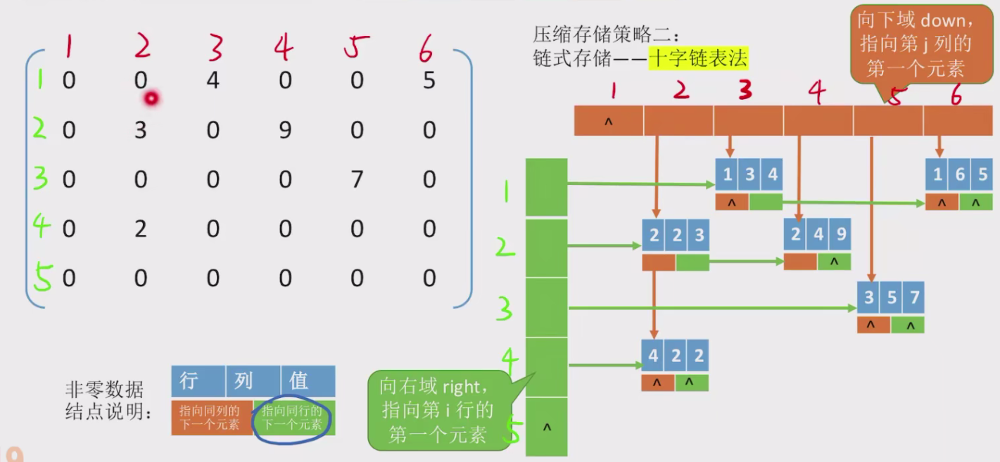

# 数组的存储结构（重要：数组和存储地址的映射关系需要自己推）

1. ### 一维数组

   各数组元素大小相同，物理上连续存放。

   **i下标从0开始的计算方法：**
   $$
   a[i]存放地址 = LOC + i * sizeof(ElemType)
   $$
   注意：除非特别说明，否则默认从0开始计算。

   

2. ### 二维数组（M行N列的二维数组）

   （1）行优先：先将一整行存到内存中，然后再存下一行。
   $$
   b[i][j]的存储地址 = LOC + (i * N + j) * sizeof(ElemType)
   $$
   （2）列优先：先将一整列存到内存中，然后再存下一列。

$$
b[i][j]的存储地址 = LOC + (j * N + i) * sizeof(ElemType)
$$

# 矩阵存储

注：普通的矩阵它的行号和列号通常是从1开始的（具体需要审题）。

1. ### 对称矩阵

   只存储**主对角区**和**下三角区**，**按行优先**的原则将元素存入一维数组。、

   注：

   - 存储最后一个元素的下标（数组大小）：(1 + n) / 2;

   - 怎么使用存储后的数组？实现一个映射函数（矩阵下标 -> 一维数组下标）。此处需要灵活根据题目使用！！！

   - 常见出题方式：存上三角，下三角，行优先，列优先，矩阵下标从0或1开始，数组下标从0或1开始。

     

2. ### 三角矩阵

   - 下三角矩阵：除了主对角线和下三角区，其余元素均相同c。

   - 存储策略（以下三角为例）：按列优先将下三角及其主对角线元素存入一维数组，并在最后一个位置存储常量c。
   - 数组大小：(n - 1) * n / 2 - 1 = (n + 1) * n / 2。

   

3. ### 三对角矩阵

​		所有在主对角线的元素是非零元素，同时从主对角线出发上下左右的元素也可以是非零元素（当|i - j| > 1时，有a~ij~ = 0。

注：

- 数组大小为3n - 2,最后一个元素的数组下标为3n - 3（从0开始的话）

4. ### 稀疏矩阵

   非零元素远远少于矩阵元素个数。

   

   存储策略：

   - 顺序存储：使用三元组<行，列，值>;

   - 十字链表法

     