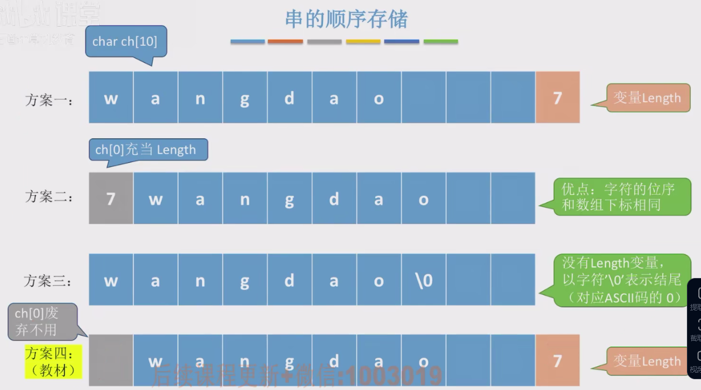

# 串的定义

​		字符串（串）是由零个或多个字符组成的有限序列，一般记为S = 'a~1~a~2~...a~n~'。其中，S为**串名**，单引号括起来的是**串的值**，a可以是**字母数字或其他字符**，串中字符的个数n称为串的长度。n = 0时称为**空串**。

​		串也是一种特殊的线性表。串对存入的数据类型进行限制。


1. ### 串的基本操作：

   串的基本操作（增删改查）通常以子串作为操作对象。

   - StrAssign(&T, chars)：将串T赋值为chars；

   - StrCopy(&T, S)：将串S复制得到串T；

   - StrEmpty(S)：若S为空串返回TRUE，否则返回FALSE；

   - StrLength(S)：返回串S的元素个数（空格也算一个元素）；

   - ClearString(&S)：将S清为空串（不回收存储空间）；

   - DestroyString(&S)：将S销毁（回收存储空间）；

   - Concat(&T, S1, S2)：用T来返回由S1和S2相连形成的新串；

   - SubString(&Sub, S, pos, len)：用Sub返回串S的第pos个字符开始长度为len的子串；

   - Index(S, T)：若主串S存在与串T相同的子串，则返回第一次T在S中第一次出现的位置，没找到就返回0；

   - StrCompare(S, T)：若S > T, 则返回值>0，若S = T，则返回值 = 0，若S < T，则返回值小于0。

2. ### 串的基本概念：

   - 子串：串中任意连续字符组成的子序列；
   - 主串：包含子串的串；
   - 字符在主串中的位置：字符在串中的序号；
   - 子串在主串中的位置：子串的第一个字符在主串中的位置；
   - 空串（M=''）与空格串（M=' '）不同。


# 串的存储结构

1. ### 顺序存储：

   使用**静态数组**进行存储（就是将顺序存储中的ElemType换为char），也称为**定长顺序存储**。

   使用**动态数组**进行存储（指针的变量类型变成char），称为**堆分配存储**，需要手动**free**申请的内存空间。

   注：使用顺序存储串的优缺点（结合线性表中顺序存储进行回答）

   - **优点：**随机存取，可以立即找到想要的字符；

   - **缺点：**插入删除不方便。

     

     **推荐使用方案四：**这样既可以使串从数组下标1开始，还能存储任意大小。

     

2. ### 串的链式存储：

   - 一个字符一个结点：

     ```c++
     typedef struct StringNode{
         char ch;  //每个结点存一个字符
         struct StringNode *next;
     }StringNode, *String;
     ```

     

   - 多个字符一个结点（结点中空余的位置使用特殊字符如**#**来代替）：

     ```c++
     typedef struct StringNode{
         char ch[4];  //每个结点存4个字符
         struct StringNode *next;
     }StringNode, *String;
     ```

     

3. ### 串的基本操作的实现：

   - 求子串：

     ```c++
     
     ```

     

   - 串的比较：

     ```c++
     
     ```

     

   - 求串在子串中的位置：

     ```c++
     
     ```

     