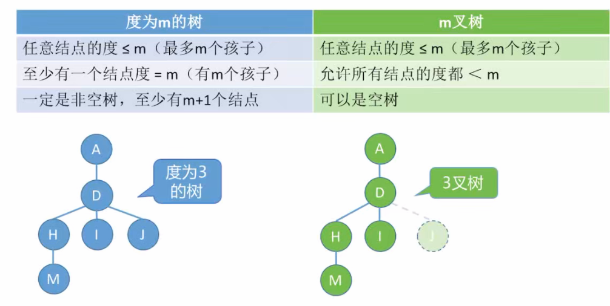
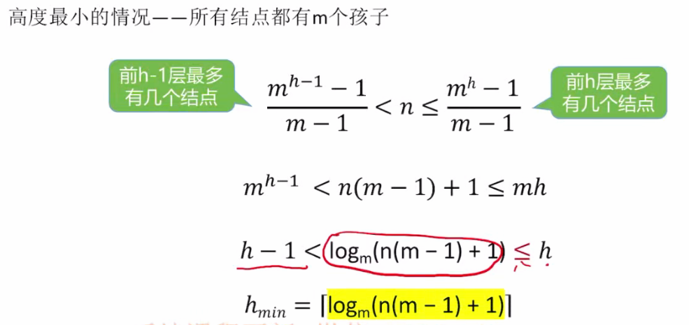

# 树的基本概念

1. ### 非空树的特性：

- 有且仅有一个根节点；
- 没有后继的结点称为“叶子结点”；
- 有后继的结点称为“分支结点”；
- 除了根节点之外每个结点有且仅有一个前驱；

2. ### 子树：

​		非空树的除根节点以外的结点可以分为互不相交的有限集合，其中每个集合都是一个树，称为根节点的子树。

3. ### 结点之间的关系：

- 祖先结点：
- 子孙结点：
- 双亲结点（父结点）：
- 孩子结点：
- 兄弟结点：
- 堂兄弟结点：
- 两个结点之间的路径长度（只能从上往下）：指从上面的结点开始到下面的结点经过了几条边。

4. ### 结点、树的属性描述：

   - 结点的层次（深度）：从上往下数；
   - 结点的高度：从下往上数，越往上的结点高度越高；
   - **结点的度：**一个结点有几个孩子（分支）；
   - **树的度：**各结点度的最大值。

   

注意：考试时树的根节点可能从第0层开始计算，虽然默认是第1层。

5. ### 有序树 vs 无序树：

   - 有序树：从逻辑上看，树中结点的各子树从左到右有次序，因此不能交换；

   - 无序树：无次序，可以交换。

     

6. ### 树 vs 森林（考点：树和森林相互转化的问题）

   森林是m棵互不相交的树的集合。

# 树的常考性质

1. 结点数 = 总度数 + 1

2. ### 度为m的树 vs m叉树（选择题易考）：

   树的度——各个结点中度的最大值；

   m叉树——每个结点最多只能有m个孩子的树

3. 度为m的树（或m叉树）第i层至多有**m^i-1^**个结点

4. 高度为h的m叉树至多有**(m^h^ - 1) / (m - 1)**个结点（等比数列求和）

5. 高度为h的m叉树至少有**h**个结点（每一个结点都只有一个孩子结点）；

   高度为h，度为m的树至少有**h + m - 1**个结点（至少要保证有一个结点有m个孩子结点）。

6. 具有n个结点的m叉树的最小高度为

