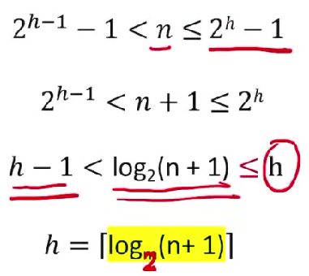
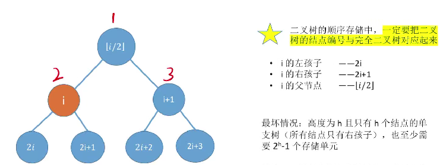

# 二叉树的基本概念

1. ### 特点：

   二叉树的每个结点至多只有两棵子树，左右子树不能颠倒（二叉树为有序树）。

   

2. ### 几种特殊的二叉树：

   - **满二叉树：**高度为h，含有2^h^ - 1个结点的二叉树。

     ​	**特点：**

     ​	（1）只有最后一层有叶子结点；

     ​	（2）不存在度为1的结点；

     ​	（3）按层序从1开始编号，左孩子为**2i**，右孩子为2i+1，父节点为**i/2**向下取整。

   - **完全二叉树：**树中的每一个结点都与高度为h的满二叉树中结点的编号一一对应时，才能被称为完全二叉树。

     ​	**特点：**

     ​	（1）只有**最后两层**可能出现**叶子结点**；

     ​	（2）最多**只有一个度为1的结点**；

     ​	（3）按层序从1开始编号，左孩子为**2i**，右孩子为2i+1，父节点为**i/2**向下取整；

     ​	（4）i <= n/2向下取整时，为分支结点；i > n/2向下取整时，为叶子结点。

   - **二叉排序树：**左子树的所有结点的关键字均小于根节点的关键字；右子树上的所有结点的关键字均大于根节点的关键字；左子树与右子树又各是一颗二叉排序树。**（可用于元素的排序、搜索）**

   - **平衡二叉树：**树上任意一个结点的左子树与右子树的深度之差不超过1。

     注：使用平衡二叉树有更高的搜索效率。


# 二叉树的常考性质

1. 设非空二叉树中度为0、1、2的结点个数分别为n~0~、n~1~、n~2~，则**n~0~ = n~2~ + 1**（即叶子结点的个数比有两个孩子结点的结点个数多1）；**（高频考点）**

2. 高度为h的二叉树最多有**2^h^ - 1**个结点（满二叉树）；

3. 二叉树的第i层最多有**2^i-1^**个结点；

4. 具有n个结点的完全二叉树的高度为**log~2~(n+1)向上取整**或**log~2~n向下取整+1**。

   

5. 对于完全二叉树，可以由结点数来推出度为0、1、2的结点个数。

   **推导过程：**完全二叉树最多有一个度为1的结点（n~1~ = 0或1）；n~0~ = n~2~ + 1（n~0~ + n~2~一定为奇数）。

   - 若完全二叉树有2k个结点，则n~1~ = 1，n~0~ = k，n~2~ = k - 1；
   - 若完全二叉树有2k-1个结点，则n~1~ = 0，n~0~ = k，n~2~ = k - 1。


# 二叉树的存储结构

1. ### 顺序存储：

   **缺点：**只**适合存储完全二叉树**，当存储非完全二叉树时非常浪费存储空间。

   

   

2. ### 链式存储：

```c++
typedef struct BiTNode{
    ElemType data;
    struct BiTNode *lchild, *rchild;
}BiTNode, *BiTree
```

注：n个结点的二叉链表共有n+1个空链域（可用于构建**线索二叉树**）。


# 二叉树的遍历

1. ### 先序遍历：根左右

   ```c++
   void PreOrder(BiTree T)
   {
       if(T != NULL){
           visit(T);
           PreOrder(T->lchild);
           PreOrder(T->rchild);
       }
   }
   ```

   

2. ### 中序遍历：左根右

   ```c++
   void InOrder(BiTree T)
   {
       if(T != NULL){
           InOrder(T->lchild);
           visit(T);
           InOrder(T->rchild);
       }
   }
   ```

   

3. ### 后序遍历：左右根

   ```c++
   void PostOrder(BiTree T)
   {
       if(T != NULL){
           PostOrder(T->lchild);
           PostOrder(T->rchild);
           visit(T);
       }
   }
   ```

   

4. ### 求树的深度：

   ```c++
   int treeDepth(BiTree T)
   {
       if(T == NULL)
       {
           return 0;
       }else{
           int l = treeDepth(T->lchild);
           int r = treeDepth(T->rchild);
           
           //树的深度 = max{左子树的深度，右子树的深度} + 1
           return l > r ? l+1 : r+1;
       }
   }
   ```

   

5. ### 层序遍历：

   - 初始化一个辅助队列；
   - 根节点入队；
   - 若队列非空，则队头结点入队，访问该结点，并将其左右孩子结点插入队尾；
   - 重复上一个步骤直到队列为空。


# 由遍历序列来构造二叉树

​		若只给出一棵二叉树的前中后层序遍历序列的一种，那么无法得出唯一一棵二叉树。

- 层 + 中
- 先 + 中
- 后 + 中

主要步骤：先找到树的根节点；然后再根据中序遍历划分左右子树；最后再找到左右子树的根节点。