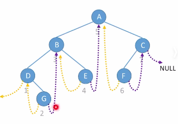
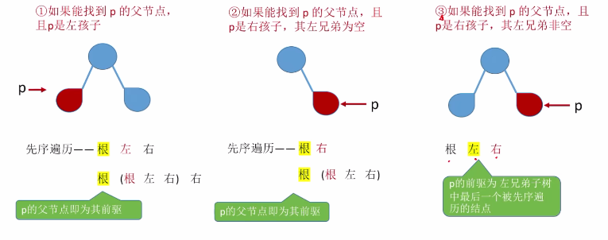
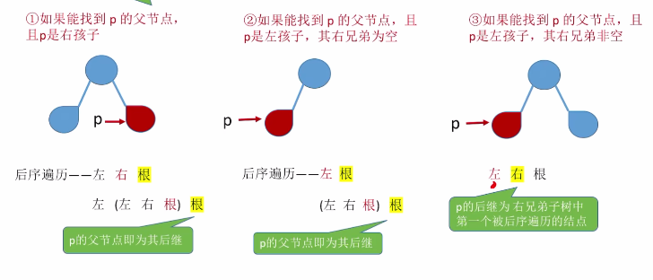

# 线索二叉树的概念

​		n个结点的二叉树，有n+1个空链域，这些地方可以记录前驱后继的信息。



图中为中序线索二叉树（中序遍历的序列：DGBEAFC）

前驱线索（**左孩子**指针）

后继线索（**右孩子**指针）

```c++
//tag == 0表示指针指向孩子， tag == 1表示指针为线索
typedef struct ThreadNode{
    ElemType data;
    struct ThreadNode *lchild, *rchild;
    int ltag, rtag;  //左右线索标志
}ThreadNode， *ThreadTree
```


注：（先序，后序）中序前驱、（先序，后序）中序后继的意思是按照中序遍历得到的序列中指定元素的前驱和后继。


### 考点：手算画出线索二叉树

1. 确定线索二叉树是先序中序还是后续；
2. 按照相应的遍历规则，确定结点访问序列，并给每个结点写编号；
3. 按照遍历序列给每个结点添加前驱或后继。


# 二叉树的线索化

```c++

```

易错点：

- 需要对最后一个结点的rchild和rtag进行处理；
- 进行**先序线索化**时，注意T->lchild可能会指向前驱而导致循环遍历同一个结点，因此需要加入判断ltag == 0时，才对左子树进行先序线索化。


# 通过线索二叉树来寻找前驱和后继

1. ### 中序线索二叉树

   - 找后继结点

     ```c++
     //若p->rtag == 1，说明已经存在后继了，那么next = p->rchild得到的就是这个结点的后继结点
     //若p->rtag == 0，说明结点p还有右孩子，因此需要找到以p为根节点的右子树中的最左下角的结点作为其后继
     ThreadNode *Firstnode(ThreadNode *p)
     {
         //通过while循环找到最左下角的结点
         while(p->ltag == 0)
         {
             p = p->lchild;
             return p;
         }
     }
     
     //找到结点p的后继结点
     ThreadNode *Nextnode(ThreadNode *p)
     {
         if(p->rtag == 0) return Firstnode(p->lchild);
         else return p->rchild;
     }
     
     //对中序线索二叉树进行的中序遍历（非递归）
     void Inorder(Threadnode *T)
     {
         for(Threadnode *p = Firstnode(T); p != NULL; p = Nextnode(p))
         {
             visit(p);
         }
     }
     ```

     注：中序遍历的非递归版本的空间复杂度为O(1)。

   - 找中序前驱

     ```c++
     //若p->ltag == 1，说明已经存在前驱了，那么pre = p->lchild得到的就是这个结点的前驱结点
     //若p->ltag == 0，说明结点p还有左孩子，因此需要找到以p为根节点的左子树中的最右下角的结点作为其前驱
     ```

     注：对中序线索二叉树进行逆向中序遍历

2. ### 先序线索二叉树

   - 找先序后继

     ```c++
     //若p->rtag == 1，说明已经存在后继指针了，那么next = p->rchild
     //若p->rtag == 0，假设该节点有左孩子，那么next = p->lchild；假设没有左孩子，那么有孩子就是它的后继，next = p->rchild
     ```

     

   - 找先序前驱

     ```c++
     //若p->ltag == 1，说明已经存在前驱指针了，那么next = p->lchild
     //若p->ltag == 0，那么找不到它的前驱结点
     ```

     注意：当p**能够找到它的父结点**，那么就**能找到先序前驱**（若p是**根结点**，那么它是真的没有前驱了，直接指向NULL）。

     

3. 后续线索二叉树

   - 找后序后继

     ```c++
     //若p->rtag == 1，说明已经存在后继指针了，那么next = p->rchild
     //若p->rtag == 0，那么找不到它的后继结点
     ```

     注意：当p能找到它的父结点时，那么就能够找到后序后继（若p是根节点，那么p没有后序后继）。

     

   - 找后序前驱

     ```c++
     //若p->ltag == 1，说明已经存在前驱了，那么pre = p->lchild得到的就是这个结点的前驱结点
     //若p->ltag == 0，若p有右孩子，那么pre就是p的右孩子；若p没有右孩子，那么pre就是p的左孩子
     ```


### 总结：

​		先序线索二叉树无法找到前驱；后序线索二叉树无法找到后继；但是当使用三叉链表且能够找到p结点的父结点时，可以找到前驱后后继。