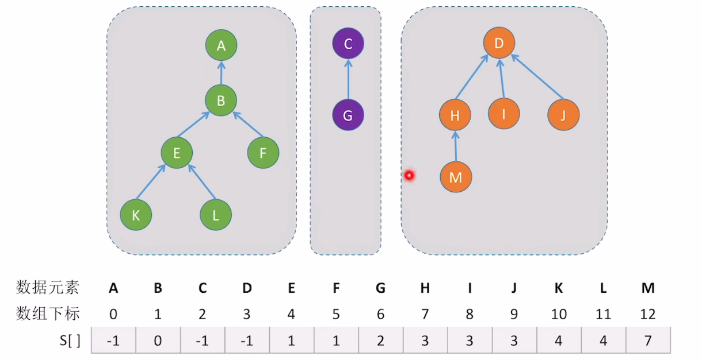

# 逻辑结构

​		将每个元素划分为若干互不相交的集合。这里可以利用森林的概念，使用多个互不相交的树，来表示多个集合。


**查：**从指定元素出发，找到它所属的根节点。

**判断两个元素是否属于同一个集合：**分别找到这两个元素所属的根，判断这两个根是否相同。

**两个集合合并：**让一棵树成为另一棵树的子树即可。



并查集的实现与使用**双亲表示法表示森林**类似。


# 代码实现

1. ### 并查集实现

   ```c++
   [[define]] SIZE 10
   int UFsets[SIZE];  //集合元素数组
   
   //初始化操作就是将所有数组元素全部变为-1
   void Initial(int S[])
   {
       for(int i = 0; i < SIZE; i++)
       {
           S[i] = -1;
       }
   }
   ```

   

2. ### 查操作

   ```c++
   //找到x所属集合的根节点
   int Find(int S[], int x)
   {
       while(S[x] >= 0)
       {
           x = S[x];
       }
       return x;
   }
   ```

   

3. ### 并操作 O(1)

   ```c++
   void Union(int S[], int Root1, int Root2)
   {
       //两根相等，无法合并
       if(Root1 == Root2)
       {
           return;
       }
       S[Root2] = Root1; //将Root2连接到Root1的下面
   }
   ```

   由于当树太高时，查操作所花费的时间复杂度会越来越大，因此考虑对合并操作进行优化，使并查集的大小尽可能小。

   ```c++
   //用根节点的绝对值表示树的结点总数（如S[Root] = -6代表该集合存在6个结点
   //合并操作：小树合并到大树上
   void Union(int S[], int Root1, int Root2 )
   {
       if(Root1 == Root2)
       {
           return;
       }
       //将结点数更少的树并到结点数更多的树上
       if(S[Root2] > S[Root1])
       {
           S[Root1] += S[Root2];
           S[Root2] = Root1;
       }else{
           S[Root2] += S[Root1];
           S[Root1] = Root2;
       }
   }
   ```

   

# 并查集的进一步优化

### Find操作的优化（压缩路径）

​		先从目标结点向上找到根节点，再将查找路径上的所有结点都挂到根节点之下。

```c++
//先找到根节点，再进行“压缩路径”
int Find(int S[], int x)
{
    int root = x;
    while(S[root] >= 0) root = S[root];  //循环找到根节点
    
    //压缩路径
    while(x != root)
    {
        int t = S[x];
        S[x] = root;
        x = t;
    }
    return root;
}
```

