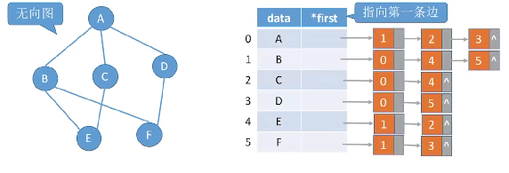
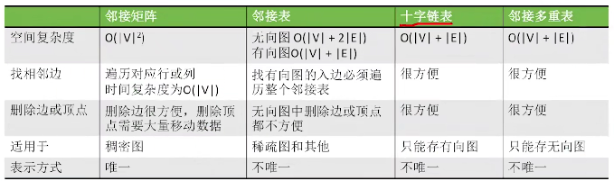

# 邻接矩阵

​		用矩阵存储图，0表示两个顶点之间不存在邻接关系，1表示两个顶点存在一条边。

```c++
#define MAXSIZE 100
typedef struct{
    char V[MAXSIZE];  //存储顶点的表
    int Edge[MAXSIE][MAXSIZE];  //存储邻接矩阵的边
    int vexnum, edgenum;  //存储顶点数和边数
}MGraph
```


1. 第i个结点的度 = 第i行或列的非零元素个数；

2. 第i个结点的出度 = 遍历第i行的非零元素；

   第i个结点的入度 = 第i列；

   第i个结点的度 = i行i列元素和。


3. 若使用邻接矩阵存储带权图：

   边的位置使用对应的权值代替，若无法连通，那么该位置用0或∞代替。


4. 邻接矩阵的性质：设图G的邻接矩阵为A（无向图），则A^n^的元素A^n^[i] [j]等于从顶点i到顶点j的长度为n的路径的数目。

注意：

- 考试可能会使用**压缩矩阵**的方式来存储邻接矩阵所代表的图。
- 邻接矩阵存储的缺点：当图为稀疏图式（边很少），浪费存储空间，只适合存储稠密图。


# 邻接表（顺序+链式存储）



注：邻接表与孩子表示法存储树类似。


若边结点的数量是2|E|：整体空间复杂度为O(|V|+|E|)(有向图)；O(|V|+2|E|)(无向图)。


1. 求顶点的度：遍历这个结点的边链表；
2. 求出度：遍历这个结点的边链表；
3. 求入度：将所有的边链表全部遍历一遍。


总结：对于邻接表来说，求有向图的**入度不方便**（缺点），其余很方便；并且对于**同一个图**的**邻接表的表示方式可能会有多种**。


# 十字链表(只能用于存储有向图)


找入边：顺着绿色线路找

找出边：顺着橙色线路找

空间复杂度：O(|V|+|E|)


# 邻接多重表（只用于存储无向图） 


总结：

