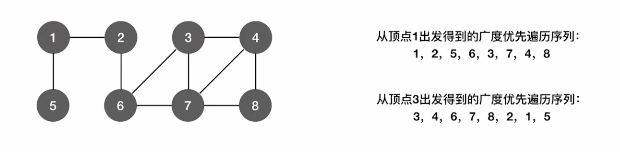
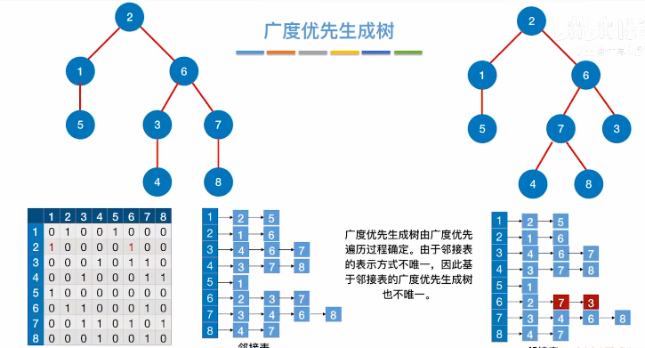
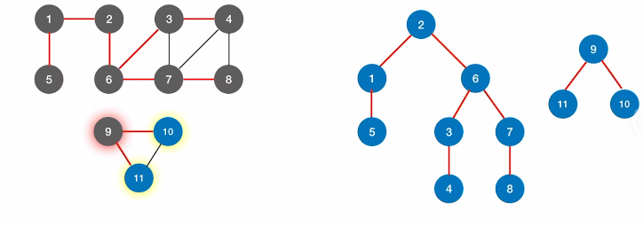

# 广度优先遍历

1. ### BFS要点：

   - 找到与一个顶点相邻的所有顶点；

   - 标记哪些顶点被访问过；

     bool visited[MAX]：初始值都为false，用于标记哪些顶点被访问过。

   - 使用辅助队列来完成。

   - **FirstNeibor(G, x)：**找顶点x的第一个邻接点；

     **NextNeibor(G, x, y)：**y为x的一个邻接点，返回除了y之外x的下一个邻接点的顶点号。

   

2. ### 遍历步骤：



注：广度优先遍历的遍历序列若采用**邻接矩阵**存储的话，那么对于一个结点的邻接点是**递增的次序遍历**的；但是如果使用**邻接表**进行存储的话，**可能不会是递增次序**，因为邻接表存储顺序具有**可变性**。


4. ### 对于BFS的改进：

   当出现非连通图时，BFS无法遍历所有的结点，因此需要加上一个新的函数依次判断每个结点是否已经被遍历过了。

   

   **结论：**对于无向图，BFS函数的调用次数 = 连通分量数

   

5. ### 代码实现：

   ```c++
   
   ```

   

6. ### 复杂度分析：

   空间复杂度：O(|V|)

   时间复杂度：

   - **邻接矩阵**存储：O(|V|^2^)
   - **邻接表**存储：O(|V| + |E|)


注意：在分析BFS和DFS的时间空间复杂度时，**不需要**研究代码中**循环次数最多**的地方，而是需要**分析访问顶点和找各条边所花费的时间和空间**。


7. ### 广度优先生成树：

   

8. ### 广度优先生成森林：

   对于非连通图进行广度优先遍历，能得到森林。

   