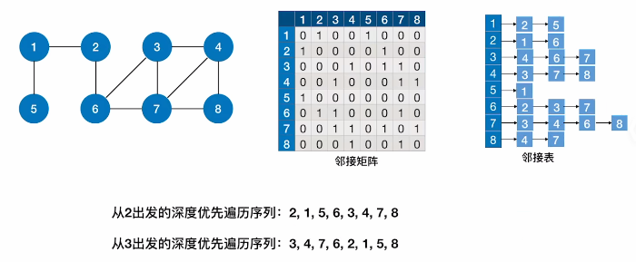

# 深度优先遍历

​		与树的先根遍历算法类似。


1. ### 代码实现：

   ```c++
   
   ```

   

2. ### 复杂度分析：

   空间复杂度：O(|V|)

   时间复杂度：

   - 邻接矩阵：O(|V|^2^)
   - 邻接表：O(|V|+|E|)

3. ### 遍历步骤：

   

   注：不同邻接表**深度优先**得到的遍历序列**不唯一**。

4. ### 深度优先生成树（森林）：与BFS类似

   

5. ### 总结：

   - 对于**无向图**来说：BFS / DFS函数的调用次数 = **连通分量数**；

     对于**连通图**来说：BFS / DFS函数的调用次数 = 1。

   - 对于**有向图**来说：BFS / DFS函数的调用次数需要具体分析（从每个结点出发结果不同），若**起始顶点到其他各个顶点都有路径**，则只需要调用一次；

     对于**强连通图**来说：**任一顶点**出发都**只需要调用一次**BFS / DFS函数。