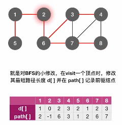

### 单源最短路径

- BFS算法（无权图）
- Dijkstra算法（带权图、无权图）

​		从一个结点出发，到其他结点的最短路径是什么。


### 每对顶点之间的最短路径

​		不同顶点之间的最短路径是什么。

- Floyd算法（带权图、无权图）


# 使用BFS求无权图的单源最短路径

​		无权图可以看作边权值为1的带权图。

****

### 代码：

```c++

```


注：使用**BFS**构建的生成树一定是**高度最小**的。