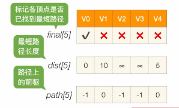

# BFS算法的局限性

​		处理带权图时，BFS算法得出的结果就不是最优的。

# Dijkstra算法

​		**适合**求解**有回路的带权图的最短路径**，也可以求**任意两个顶点的最短路径**，但是**不能**求**负权值**的最短路径问题。

1. ### 具体步骤：

   - 设置一个**final数组**，一个**dist数组**，一个**path数组**；

     

   - 选择一个V~0~开始，初始化这三个信息：V~0~的**dist[0] = 0**，与V0相邻的几个结点的dist为它们的**边的权值**，并且它们的**path值为0**（前驱设置为V~0~）；

   - 遍历所有结点，找到其中所有**没有确定最短路径的结点**，找到**dist最小**的结点V~i~，并且令**final[i] = true**;
   - 以此类推，直到**所有顶点的final都为true**。

2. ### 时间复杂度：O(|V|^2^)或O(n^2^)

注意：当出现权值为负的边时，Dijkstra算法就可能失效。