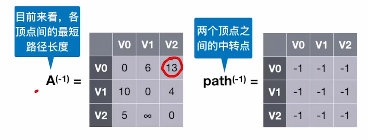

# Floyd算法

​		用于求出每一对顶点之间的最短路径。

1. ### 算法步骤：

   - 创建一个数组A（直接使用邻接矩阵存储的数组）和一个数组path；

     

   - 初始：假设不允许其他顶点中转，那么每对顶点之间的最短路径是什么？

   - 假设允许使用V~0~作为中转点，每对顶点之间是否能存在最短路径或者说有更短的路径？若成功找到最短路径，那么修改数组A的最短路径长度，并修改path；

   - 依次使用V~1~，V~2~，V~3~，...，V~n~，当完成所有顶点的寻找时，得到的数组A即为每对顶点之间的最短路径。

     

2. ### 复杂度分析：

   - 时间复杂度：O(|V|^3^)
   - 空间复杂度：O(|V|^2^)

注：Floyd算法**可以解决带有负权值的图**，但是**无法解决带有负权回路的图**（有负权值的边形成回路），这种类型的图可能没有最短路径。

# 三种求最短路径的算法比较

注：使用Dijkstra算法也能**解决带权图**问题，就是将最短路径的求法**重复|V|次**即可（即求出所有结点的最短路径），时间复杂度也是**O(|V|^3^**) 。