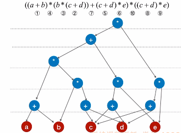
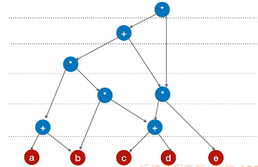
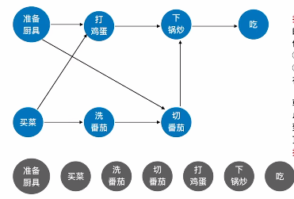

# 有向无环图DAG

​		一个**有向图**中**不存在环**，则称作有向无环图。

# 使用DAG解决操作数问题

1. 把各个操作数不重复的排成一排；
2. 标出各个运算符的生效循序（不一定要严格正确）；
3. 按顺序加入运算符，注意分层（操作数放在最底层，再将运算符从下往上排）；
4. 当所有操作都排列完毕后，从低向上检查同层的运算符是否存在可以合体的，并将其合并。

**前三步完成后：**

**第四步将重复运算合并后：**

# 使用DAG解决AOV网（拓扑排序）

​		AOV网**（不能存在环路即有向无环图）**表示用顶点表示活动的图。使用DAG图表示一个工程，顶点表示活动，有向边<V~i~, V~j~>表示活动V~i~必须先于活动V~j~执行。

1. ### 拓扑排序的实现：

   - 从AOV网中选择一个**没有前驱的顶点（入度为0）**并输出；**（说明这些顶点为起始步骤）**

   - 从网中删除**该顶点**和所有**以它为起点的有向边**；

   - 重复以上两步直到**AOV网为空**或者**网中不存在无前驱的顶点为止（存在回路）**。

     

2. ### 算法时间复杂度：

   使用邻接表：O(|V|+|E|)

   使用邻接矩阵：O(|V|^2^)

3. ### 逆拓扑排序：

​		选择一个**出度为0（没有后继）**的顶点输出，其余步骤与拓扑排序相同。

注意：

- 使用**邻接表**来实现逆拓扑排序**时间复杂度会非常大**，因此推荐使用**邻接矩阵**和**逆邻接表**。
- 若图中有环，那么逆拓扑排序也不能使用；
- 拓扑排序和逆拓扑排序得到的序列都不唯一；
- 有向无环图的拓扑序列唯一，并不能说明该图唯一。