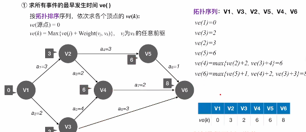
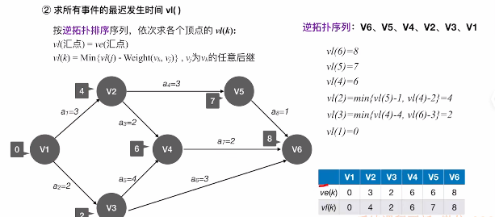

# AOE网

​		在带权有向图中，以顶点表示事件，以有向边表示活动，边上的权值表示完成活动的开销。

1. ### AOE网的性质：

   - 只有在某个顶点所代表的事件发生之后，从该顶点出发**（以该顶点为起点）**的各有向边所代表的活动才能开始；

   - 只有在进行某顶**（以该顶点为终点）**点的各有向边所代表的活动结束时，该顶点所代表的事件才能发生；

   - 某些活动能够并行进行。

     

2. ### AOE网的相关概念：

   - **源点（结束顶点）：**AOE网中仅有一个**入度为0**的顶点，表示整个工程的**开始**；

   - **汇点（结束顶点）：**仅有一个**出度为0**的顶点，表示整个工程的结束。

   - **关键活动：**从源点到汇点的有向路径可能有多条，在这所有路径中，**最大路径长度的路径**称为**关键路径**，在关键路径上的活动称为**关键活动**。

   - 活动**最早开始时间**；

   - 活动**最迟开始时间**；

   - 活动**时间余量** = 最迟 - 最早（活动的**时间余量**为0时，代表该活动必须如期完成，表示该活动是**关键路径**上的**关键活动**）；

     

3. ### 求关键路径的步骤（主要考察点）：

   - 求所有事件的**最早发生时间ve()**：使用**拓扑排序**，按照排序之后的序列依次求各个顶点的**ve(k)**，其中
     $$
     ve(源点) = 0，ve(k) = Max{ve(j) + Weight(v_j, v_k)}
     $$
     （v~j~为v~k~的任意一个**前驱**）

     

   - 求所有事件的**最迟发生时间vl()**：使用**逆拓扑排序**，依次求各点的vl(k)，其中
     $$
     vl(汇点) = ve(汇点)，vl(k) = Min { vl(j) - Weight(v_k, v_j) }
     $$
     （v~j~为v~k~的任意后继）

     

   - 求所有活动的**最早发生时间e()**：
     $$
     e(i) = ve(k)
     $$
     （边<v~k~, v~j~>表示活动a~j~即**这条边的终点**）

   - 求所有活动的最迟发生时间l()：**最晚发生时间 - 权值**
     $$
     l(i) = vl(j) - Weight(v_k, v_j)
     $$
     
   - 求所有活动的**事件余量d()**：
     $$
     d(i) = l(i) - e(i)
     $$
   
   - **d(k) = 0**的活动即为整个事件的**关键活动**，它们组成了**关键路径**。
   
     
   
4. ### 关键路径、关键活动的特性：

   - 关键活动耗时增加，工程的工期（总花费时间）会增加；
   - 缩短关键活动的时间，可以缩短工程的工期；
   - 当关键活动缩短太多，可能会变成非关键活动，关键路径也会改变；
   - AOE网中可能存在多个关键路径，因此只提高一条关键路径上的关键活动耗时不能缩短整个工程的工期；因此，只有缩短所有关键路径上共同的关键活动耗费的时间，才能缩短工期。