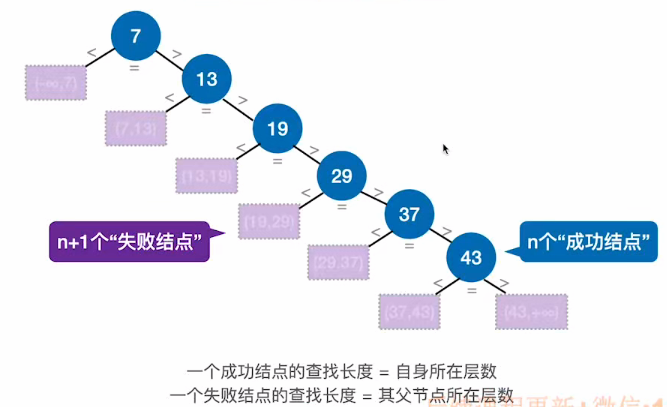

# 算法思想（线性查找）

​		通常用于**线性表**，从头到尾查找。

# 查找效率分析

$$
ASL = ∑P~i~C~i~
$$

**查找成功** = 1 * 1/n + 2 * 1/n + ... + n * 1/n = (n + 1) / 2            **O(n)**

**查找失败** = n + 1               **O(n)**

# 算法优化1（有序表）

​		对于有序表（即表中元素递增或者递减排列）

### 使用查找判定树分析ASL

**ASL~失败~** = (1 + 2 + 3 + ... + n + n) / (n + 1) = n / 2 + n / (n + 1)

**优点：**查找失败的ASL更小。

# 算法优化2（被查找的概率不相等）

​		将被查找概率大的元素放在考前位置。这样ASL~成功~效果更好，但是ASL~失败~效果不好。

**优点：**查找成功时ASL更小。