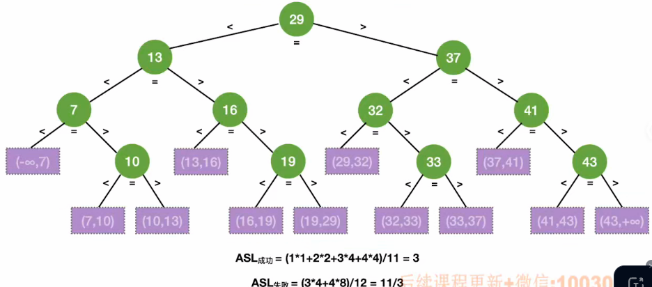

# 折半查找（二分查找）的基本思想  O(log~2~n)

​		只适用于有序的顺序表。（由于顺序表有随机访问的特性，而链表没有，因此二分查找只适用于顺序表）


### 代码实现

```c++

```


### 查找效率分析（易考察二分的查找判定树）（紫色为查找失败情况）




### 查找判定树的构造

- 若当前low和high之间有奇数个元素，那么在mid分割之后，左右两部分的元素个数相等；
- 若当前low和high之间有偶数个元素，那么分割之后，左半部分比右半部分少一个元素。


结论：

- **右子树结点树 - 左子树结点数 = 0 或 1**；即右子树永远会比左子树多一个结点或者结点数相等；
- **折半查找的判定树**一定是**平衡二叉树**；
- 折半查找判定树只有最下面一层是不满的；
- 假如元素个数为n，那么**树高h = log~2~(n + 1)向上取整**；
- 判定树中的结点关键字：左 < 中 < 右，满足二叉排序树的定义；
- 判定树中失败结点的数量 = n + 1 （成功结点空链域的数量）。


**查找成功ASL <= h**

**查找失败ASL <= h**


**易错：**折半查找的速度不一定比顺序查找更快！


**拓展：**若算法mid = (low + high) / 2为**向上取整**的话，那么查找判定树就是**左子树比右子树的结点多1个或者相等**。