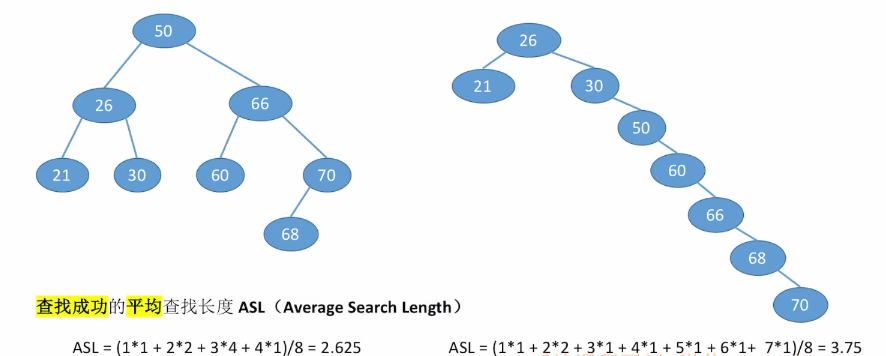
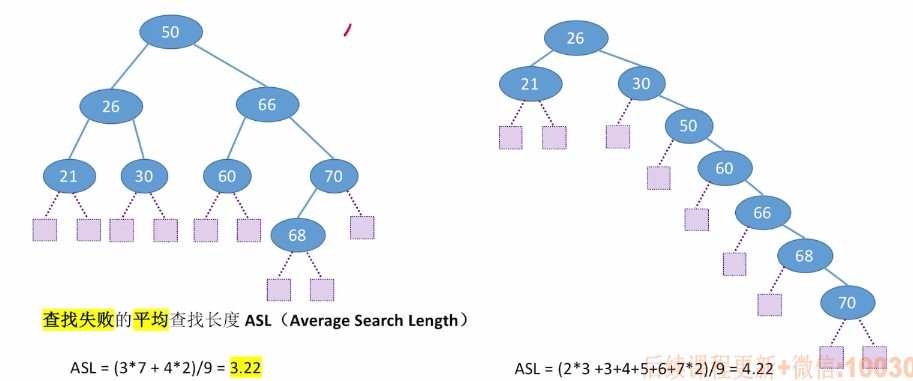

# 二叉排序树（BST）的定义

​		二叉排序树也叫二叉查找树，它的特点是：左子树结点值 < 根节点值 < 右子树结点值；

因此，进行中序遍历，可以得到一个递增的序列。


1. ### 二叉排序树的查找：

   - 若树非空，则目标值与根节点值比较；

   - 若相等，则查找成功；

   - 小于根节点，去左子树查找；否则在右子树查找；

   - 查找成功，返回结点指针，失败返回NULL。

     ```c++
     //在二叉排序树中查找值为key的结点
     //非递归
     BSTNode *BST_Search(BSTree T, int key)
     {
         while(T != NULL && key != T->key)  //若树空或者等于根节点值，结束查找
         {
             if(key < T->key) T = T->lchild;
             else T = T->rchild;
         }
         return T;
     }
     
     //递归
     BSTNode *BST_Search(BSTree T, int key)
     {
         if(T == NULL)
         {
             return NULL;
         }
         if(key == T->key)
         {
             return T;
         }
         else if(key < T->key)
         {
             return BSTSearch(T->lchild, key);
         }else{
             return BSTSearch(T->rchild, key);
         }
     }
     ```

     注：使用非递归的方式查找，时间复杂度为O(1)；使用递归查找时间复杂度为O(h)。

     

2. ### 二叉排序树的插入：

   - 若原二叉排序树为空，则直接插入结点；

   - 否则，按照查找的方式，若关键字k小于根节点值，则插入左子树，若大于根节点值，则插入右子树。

   - 由于二叉排序树不允许出现关键字相等的两个结点，因此当存在相同关键字时，插入失败。

     ```c++
     
     ```

     注：递归实现二叉排序树的插入操作，时间复杂度为O(h)。、

     

3. ### 二叉排序树的构造：

   按照给定的序列str，依次进行二叉排序树的构造操作（假设一开始为空树）。

   

   **考点：**给定一个序列，按照二叉排序树的规则对这个序列进行构造。

   

4. ### 二叉排序树的删除：

   - 先搜索找到目标结点；
   - 若被删除的是叶子结点，那么直接删除，不会影响二叉排序树的性质；
   - 若被删除的结点只有左子树或右子树，则让被删除结点的子树称为其父节点的子树，代替被删除结点的位置即可；
   - 若被删除的结点z同时有左右子树，则令z的直接后继替代z，然后从二叉排序树中删除这个**直接后继（直接前驱）**，这样就能转换成上面两种情况（叶子结点或只有左右其中一个子树）。

   注意：找**直接前驱**，就是找**左子树最右下的结点**，即左子树中中序遍历最后遍历到的结点；找**直接后继**，就是找**右子树最左下的结点**。

   

5. ### 查找效率分析ASL（重点）：

   查找长度：在查找运算中，对比关键字的次数就是查找长度。

   

最坏时间复杂度：O(h)每个结点只有一个分支。

