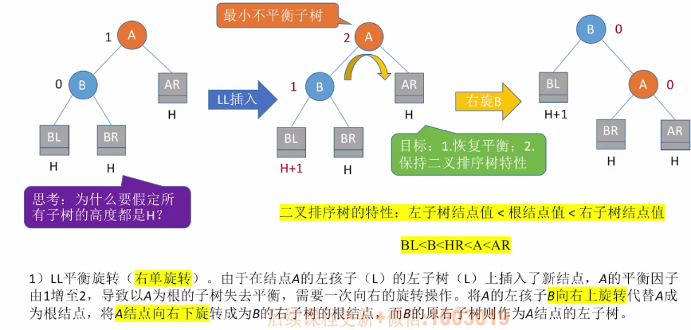
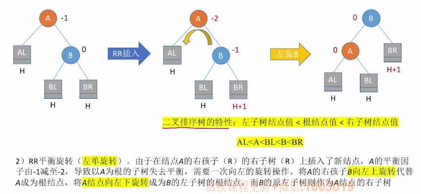
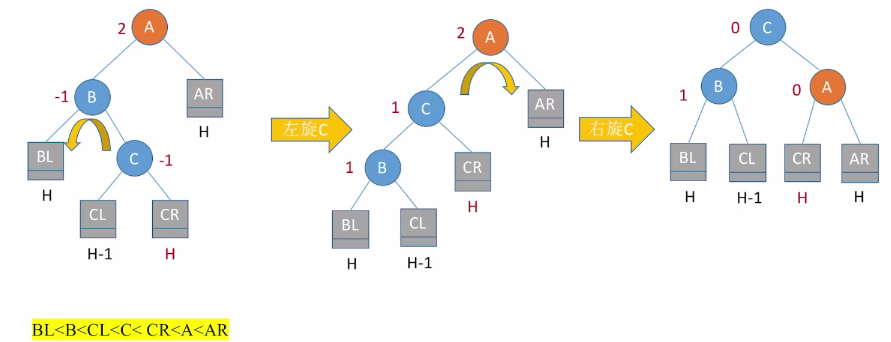
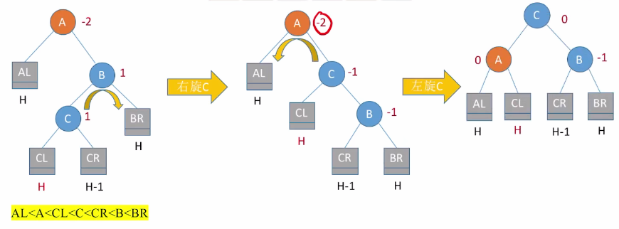

# 平衡二叉树（AVL）的定义

​		树上任一结点的左子树和右子树高度之差不超过1。


结点的平衡因子 = 左子树高 - 右子树高（AVL中任意一个结点的平衡因子只能是-1，0，1）


1. ### 平衡二叉树的插入：

   当二叉排序树插入新的结点之后，可能会使平衡二叉树出现不平衡现象。在插入操作中，只要将最小不平衡子树调整为平衡状态，那么它的祖先结点也都会恢复平衡。

   **解决方法：**从插入点往回找到**第一个不平衡的结点**，调整该结点为根的子树（每次调整的对象都是**最小不平衡子树**，即离插入结点最近的不平衡结点构成的子树）。

   

2. ### 调整最小不平衡子树：

   - **LL（在A的左孩子的左子树中插入导致不平衡）**

     

     ```c++
     A->lchild = B->rchild;
     B->rchild = A;
     Grandfather->lchild/rchild = B;
     ```

     

   - **RR（在A的右孩子的右子树中插入导致不平衡）**

     

     ```c++
     A->rchild = B->lchild;
     B->lchild = A;
     Grandfather->lchild/rchild = B;
     ```

     

   - **LR（在A的左孩子的右子树中插入导致不平衡）**

     

     

   - **RL（在A的右孩子的左子树中插入导致不平衡）**

     

总结：只有左孩子才能右上旋；只有右孩子才能左上旋。


3. ### 查找效率分析：

   假设以n~h~表示深度为h的平衡树中含有的最少结点数；

   则有n~0~ = 0， n~1~ = 1，n~2~ = 2，并且n~h~ = n~h-1~ + n~h-2~ + 1

   可以证明含有n个结点的平衡二叉树的最大深度为O(log~2~n)，平衡二叉树的ASL = O(log~2~n)。


4. ### 平衡二叉树的删除操作：

   删除结点后导致不平衡，则需要调整平衡（与插入后的调整一致）。

   

   **步骤：**

   - 删除结点（同“二叉排序树”）；

   - 向上找到最小不平衡子树，若不存在就结束了；

   - 在最小不平衡子树下，个头最高的儿子孙子（儿子和孙子都要找）；

   - 根据孙子的位置，调整平衡（LL / RR / LR / RL）

     ​		孙子在LL：儿子右单旋；

     ​		孙子在RR：儿子左单旋；

     ​		孙子在LR：孙子先左旋，再右旋；

     ​		孙子在RL：孙子先右旋，再左旋。

   - 对最小不平衡子树的选择可能会导致树变矮，若还是不平衡，则向上传导，继续第二步。