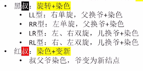

# 红黑树（RBT）的基本概念

1. ### 红黑树与平衡二叉树比较：

   - **AVL：**插入和删除操作很容易破坏平衡状态，需要频繁调整树的状态；

   - **RBT：**插入删除很多时候不会破坏红黑特性，无需频繁调整树的状态，即使需要调整，也可以在常数级时间内完成。

     

2. ### 适用场景：

   - **AVL：**以查为主，很少插入删除的场景；

   - **RBT：**适用于频繁插入删除的场景，实用性强。

     

3. ### 考点：

   - 红黑树的定义、性质（选择题）；

   - 红黑树的插入、删除过程（手绘插入过程）；

     

4. ### 定义（左根右、根叶黑、不红红、黑路同）：

   - 红黑树是一种**二叉排序树**；
   - 每个结点都是**红色**或**黑色**的；
   - **根节点**是**黑色**的；
   - **叶子结点**也是**黑色**的（失败结点、外部结点、NULL结点）；
   - 不存在两个相邻的红色结点（父节点和孩子结点必须有一个是黑色的）（兄弟结点不算）；
   - 对于每个结点来说， 从该结点到任一叶子结点的简单路径上，所含的黑结点的数目相同；
   - 结点的黑高：从某结点出发，到达任一空叶子结点的路径上黑结点的总数。

   **有关黑高的推论：**若根节点的黑高为h，那么内部结点数最少有2^h^-1个（考虑满二叉树，并且全部为黑结点）。

   

5. ### 红黑树的性质：

   - 从根结点到叶结点的最长路径不大于最短路径的2倍；
   - 有n个内部结点的红黑树h <= 2log~2~(n+1)；
   - 红黑树的查找时间复杂度 = O(log~2~n)；
   - **红黑树的查找：**与BST、AVL相同，从根出发，左小右大。若找到一个空叶子结点，则查找失败。

6. ### 红黑树的插入：

   - 先查找，确定插入位置（同二叉排序树），并插入新结点

   - 若新结点是根——染成黑色；

   - 若新结点不是根——染成红色；

   - 若插入后仍然满足红黑树的定义，则插入结束；

   - 若不满足，则调整，使其重新满足红黑树定义（看叔叔脸色行事，叔叔是新结点的父结点的兄弟结点）：

     

     

7. ### 红黑树的删除：

   - 红黑树删除操作的时间复杂度 = O(log~2~n)；
   - 红黑树的删除和“二叉排序树的删除”操作一样；
   - 删除结点之后，可能会破坏“红黑树的特性”，因此需要调整结点的颜色、位置，使其再次满足特性。