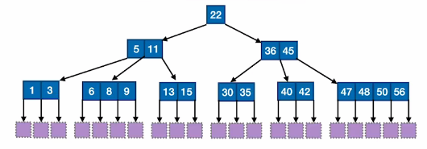
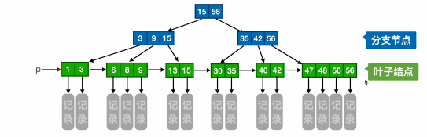

# 五叉查找树

1. ###  如何保证m叉查找树的查找效率：

   - m叉查找树中，除了根结点之外，任何结点至少有m/2向上取整个分叉，即至少含有m/2向上取整-1个关键字。（例：**除了根结点以外**，任何结点都至少有**3个分叉**，**2个关键字**）；

   - 对于任何一个结点，所有子树的高度都相同；

     

2. ### B树（多路平衡查找树）：

   

   B树中所允许的孩子个数的最大值称为B树的阶，通常用m表示，一棵m阶的B树或为空树，或满足如下特性的m叉树：

   -  树中的每一个结点至多有**m棵子树**，即至多含有**m-1个关键字**；

   - 若根节点不是终端结点，则至少有两棵子树（为了保证**子树高度相同**）；

   - 除了根结点之外，任何结点至少有m/2向上取整个分叉，即至少含有m/2向上取整-1个关键字；

   - 所有的叶结点都在同一个层次上，并且不带信息（这些结点可以视为失败结点，即结点指针指向空）。

   - 子树0 < 关键字1 < 子树1 < 关键字2 < 子树2 < ...（类比二叉查找树：左<中<右）。

     

3. ### B树的高度（计算B树的高度不包括叶子结点）：

   问题：含有n个关键字的m阶B树，最小高度、最大高度分别是多少？

   - 最小高度：让每个结点尽可能满，有m-1个关键字，m个分叉，则**h >= log~m~(n+1)**；
   - 最大高度：让各层的分叉尽可能少，即根结点只有2个分叉，其他结点只有m/2向上取整个分叉，那么**h <= log~m/2~[(n+1)/2]+1**。

4. 总结（m阶B树的核心特性）：

   **（1）尽可能满：**

   - 根结点的子树数∈[2,m]，关键字数∈[1,m-1]；
   - 其他结点的子树数∈[m/2向上取整,m]，关键字数∈[m/2向上取整-1,m-1]。

   **（2）尽可能平衡：**

   - 对于任一结点，所有**子树高度相同**；
   - 关键字的值与二叉查找树类似。

# B树的插入和删除

1. ### 插入：

   - 若插入key后， 若导致原结点的关键字超过上限，则从中间位置m/2向上取整将关键字分为两部分，左部分包含的关键字放在原结点中，右部分包含的关键字放到新结点中，中间位置m/2向上取整的结点插入原结点的父节点。

   - 若插入后导致父结点的关键字个数也超过了上限，那么继续进行分裂操作，将父结点中间的关键字作为父结点的父结点，导致B树高度增1。

     

2. ### 删除：

   - 若被删除的关键字在**终端结点**，那么直接删除该关键字（注意关键字下限是否低于m/2向上取整-1）；

   - 若被删除的关键字在**非终端结点**，那么就用直接前驱或者直接后继来代替被删除的关键字

     **直接前驱：**当前关键字左侧指针所指子树中**”最右下“**的元素；

     **直接后继：**当前关键字右侧指针所指子树中**”最左下“**的元素。

   - 若被删除后该结点**所含关键字低于下限**：

     **兄弟够借（该结点左右兄弟结点的关键字数量充裕）：**需要调整该结点左右兄弟以及双亲结点（将充裕结点最小的关键字替换到父节点，然后将父节点被替换的关键字放到低于下限的结点中）。

     **兄弟不够借：**将关键字删除后与**左或右兄弟结点**以及**双亲结点（父结点中指向这两个结点指针中间的关键字）**中的关键字进行**合并**，若合并后双亲结点不是根结点，并且关键字数量也不够时，则又要与它自己的兄弟结点进行调整或合并操作，重复以上步骤知道满足B树要求为止。

# B+树

1. 一棵m阶的B+树需要满足下面的条件：
   - 每一个分支结点最多有m棵子树；

   - 非叶根结点至少有两棵子树，其他每个分支结点至少有m/2向上取整个子树；

   - 结点的子树个数与关键字个数相等**（B树与B+树比较明显的区别）**;

   - 所有叶子结点包含全部的关键字及指向相应记录的指针，叶结点中将按照关键字的大小进行排列，并且相邻叶结点按大小顺序相互链接起来（支持顺序查找）；

   - B+树的**分支结点**中仅包含它的各个子结点中**关键字的最大值**及**指向其子结点的指针**。

     

2. ### B+树的查找：

   **注意：**即使在分支结点上找到了关键字，最后还是要到相应的叶子结点中重新找一遍。

3. ### B+树与B树：

   **m阶B+树：**

   - 结点中n个关键字对应n个分叉；

   - 根节点的关键字数n∈[1,m];

     其他结点的关键字数n∈[m/2向上取整,m]；

   - 叶子结点包含全部关键字，非叶子结点中出现过的关键字也会出现在叶子结点中；

   - 叶子结点包含信息，但是非叶子结点仅仅起到索引作用，非叶子结点的索引含有**对应子树最大关键字和指向该子树的指针**

   **m阶B树：**

   - n个关键字对应n+1个分叉；
   - B树每个结点的关键字数量有上下限；
   - 各个结点中包含的关键字是**不重复**的；
   - 结点中即包含了关键字对应的记录的存储地址。

   

4. ### 总结：

