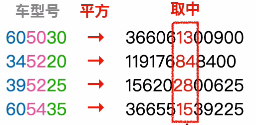

# 散列表、散列函数

1. ### 散列表：

   一种数据结构，可以根据数据元素的关键字计算它在散列表中的存储结构。

2. ### 散列函数（哈希函数）：

   **Addr = H(key)**建立了关键字到存储地址的**映射关系**。

注：理想情况下时间复杂度是O(1)。

# 冲突（碰撞）

​		在散列表中插入一个数据元素时，需要根据关键字的值确定存储地址，若该地址已经存在其他元素，则称这种情况为冲突。

**同义词：**两个关键字被映射到了同一个存储地址。

# 散列函数的构造

1. ### 需要注意：

   - 定义域必须涵盖所有的关键字；
   - 值域不能超出散列表的地址范围；
   - 散列函数计算出来的地址尽可能均匀分布在整个地址空间；
   - 散列函数尽可能简单

2. ### 除留余数法（常考）：H(key) = key % p

   散列表表长为m，取一个不大于m但是最接近或者等于m的**质数p**。  

   

   **原因：**可以使分布更加均匀，从而减少冲突。

   

3. ### 直接定址法：H(key) = key、H(key) = a*key + b

   适用于关键字的分布基本连续。 

   

4. ### 数字分析法：

   选取数码分布**较为均匀**的若干位作为散列地址，适用于关键字集合已知，且**关键字的某几个数码位分布均匀**。

   

5. ### 平方取中法：

   取关键字的平方值的中间几位作为散列地址，适用于关键字的每位取值都不够均匀。、

   

   原理：取平方之后中间几位的值会受到每个数码位的影响。

