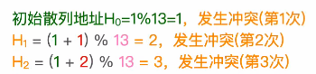
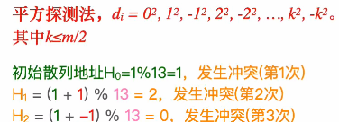
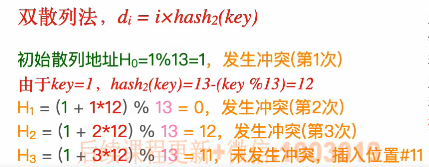
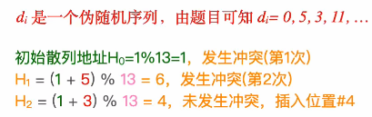

# 基本原理

​		当发生冲突时，给新元素另外找一个空闲的位置。

### 探测序列d~i~（0<=i<=m-1)：

​		H~i~ = (H(key) + d~i~) % m

注意：使用d~i~来表示当第i次放生冲突时，下一个探测地址与初始散列地址的相对偏移量。

# 构造探测序列的方法

1. ### 线性探测法：

   - **插入操作：**

   

   d~i~ = 0，1，2，3，...，m-1。

   - **查找操作：**

     根据探测序列依次对比存储单元内的关键字，若成功探测到关键字则**查找成功**，若探测到空单元则**查找失败**。

2. ### 平方探测法：

   - **插入操作：**

     

     注意：-1^2^的意思是初始散列地址左边的位置。

   - **查找操作：**与线性探测法类似。

3. ### 双散列法：

   设计第二个散列函数，当发生冲突时需要再根据第二个散列函数来确定结果。

   - **插入操作：**

     

   - **查找操作：**类似。

     

4. ### 伪随机序列法：

   给出一个伪随机序列，发生冲突时根据该序列来进行偏移。

   - **插入操作：**

     

   - **查找操作：**一样。

# 删除元素

​		当题目要求删除一个元素时，一定会具体说明采用的是哪一个探测序列。

### 具体步骤：

- 先根据散列函数来算出散列地址；
- 查找到对应的目标元素，并进行逻辑删除；
- 采用开放定址法删除元素时，不能仅仅将被删除元素的存储空间置为空，这样将会阻碍它之后的探测，应该设置一个“已删除”标记，进行**逻辑删除** **（如flag = 1代表该位置的元素被删除了）**。