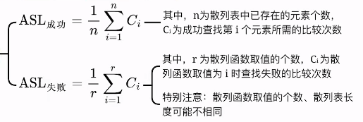

1. ### 查找成功ASL：

   (1/n)代表散列表中已经存在元素的个数，我们需要计算每个关键字查找成功时需要进行比较而当次数并求和。

   

2. ### 查找失败ASL：

   假设出现在每个初始散列地址的概率是等可能的(1/m)，我们需要计算一个关键字从初始散列地址到下一个空的散列地址所需要的比较次数（若第一个散列地址就是空的，比较次数为1）。

   

3. ### 当删除一个元素后的ASL：

   删除这个元素后，它的存储地址会被标记为逻辑删除，意思是说当查找到这个位置时并不会停下来，而是继续向后找。

   

4. ### 装填因子α：

   反映了一个散列表满的程度。当装填因子越大，越容易发生冲突，从而导致插入、查找效率降低，ASL增大。
   $$
   α = 表中记录数n/散列表长度m
   $$
   
5. ### 聚集现象：

   - 在处理冲突的过程中，几个初始散列地址不同的元素争夺同一个后继散列地址的现象被称作“聚集”；
   - 使用**线性探测法**发生冲突时，很容易造成同义词、非同义词的聚集；
   - 采用其他的探测法能够减少聚集现象。

