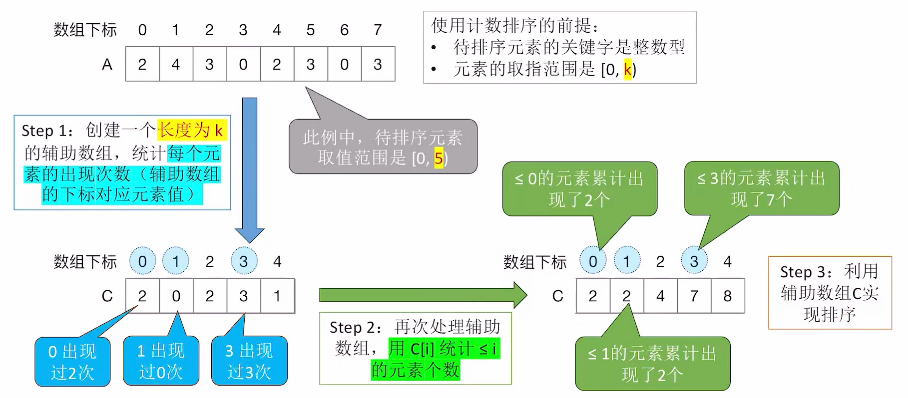
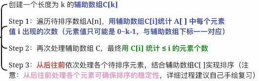
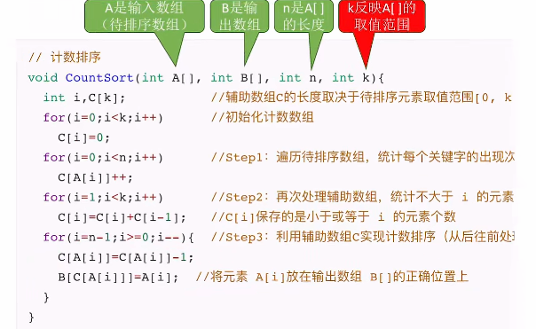
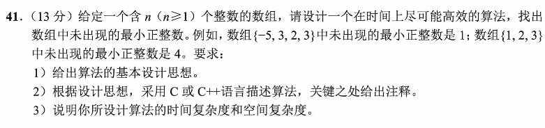

# 计数排序

1. ### 算法思想：

   

   

2. ### 代码实现：

   

3. ### 算法性能分析（空间换时间）：

   - 空间复杂度：O(n + k) 辅助数组B和C；

   - 时间复杂度：O(n + k)；

   - 若k = O(n)，那么计数排序的时间效率 = O(n)，此时计数排序的时间效率优于快速排序和堆排序等O(nlog~2~n)；

   - 若k > O(nlog~2~n)，那么计数排序不如上面二者；

   - 若待排序数组的取值范围k比较小，那么可以考虑使用计数排序；

   - 计数排序是**稳定的**。

     

4. ### 计数排序应用:

   

使用计数排序找到每个元素出现的次数，并使用数组存储。然后遍历这个数组，找到第一个值等于0的位置，这个位置就是数组未出现的最小正整数。