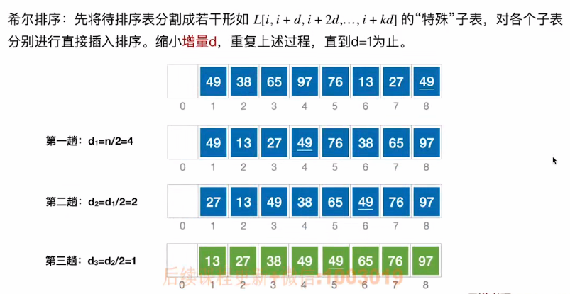

# 希尔排序（由直接插入排序改进而来）

​		先追求表中元素的部分有序，再追求全部有序。

注意：增量d可能按不同方式缩小。

### 算法性能分析：

- 空间复杂度：O(1)

- 时间复杂度：

  最坏：O(n^2^)

  n在某个范围内：O(n^1.3^)

  无法计算平均时间复杂度

- 希尔排序**不稳定**

- 希尔排序只能基于**顺序表**实现，而不能基于链表实现。

### 考点：

​		给出一个增量序列，然后分析每一趟排序后的状态。