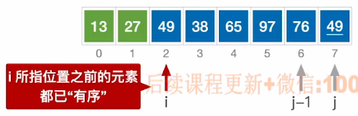

# 冒泡排序

​		从后往前两两比较相邻元素的值，若为逆序，则交换它们，直到整个序列比较完，这样被称为一趟冒泡排序。


第一趟：使关键字最小的一个元素放到序列最前面；

第二趟：使关键字最小的两个的元素放到序列最前面。

。。。


1. ### 算法实现：

   

   ```c++
   //i所指元素之前的元素都已经有序
   //只有当A[j-1]>A[j]时才进行元素交换，因此算法是稳定的
   void BubbleSort(int A[], int n)
   {
       for(int i = 0; i < n-1; i++)
       {
           bool flag = flase; //判断本趟冒泡排序是否发生了交换
           for(int j = n-1; j > i; j--)
           {
               if(A[j-1] > A[j])
               {
                   swap(A[j-1], A[j]);
                   false = true;
               }
           }
           if(flag = false)
           {
               return;  //若本趟遍历之后没有发生交换，说明表已经有序了，不需要进行下一趟了
           }
       }
   }
   ```

   

2. ### 算法性能分析：

   - **空间复杂度：** O(1)

   - **最好的时间复杂度：**O(n)  原本有序

   - **最坏的时间复杂度：**O(n^2^)  原本逆序  比较次数 = (n-1) + (n-2) + ... + 1 = n * (n-1) / 2 = 需要交换的次数

   - **平均时间复杂度：**O(n^2^)

   - 冒泡排序是**稳定的**；

   - 冒泡排序可以用于链表（从头开始进行交换）。

     

   **注意：**

   （1）**移动元素**与**交换元素**不是一个概念；

   （2）**移动元素**指的是**swap函数**中元素的交换次数，调用一次swap函数就会**移动元素3次**。