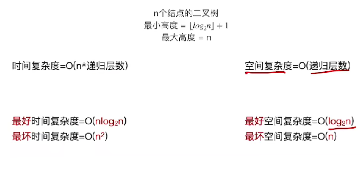

# 快速排序

​		设置一个low和一个high指针，将low作为基准元素pivot，通过一趟排序将表以pivot划分为左右两部分，左边的元素都小于pivot，右边的元素都大于pivot，这样就能确定pivot这个元素的确定位置，称为一趟排序。当每一个部分都只有一个元素或者为空了，那么说明所有元素都排序完毕。


1. ### 代码实现（考察重点）：

   ```c++
   //将所有元素按照pivot划分为左右两个部分
   int Partition(int arr[], int low, int high)
   {
   	int pivot = arr[low];  //将第一个元素作为枢纽
       while(low < high)
       {
           while(low < high && arr[high] >= pivot) --high;
           arr[low] = arr[high];  //比枢纽元素小的放到左边
           while(low < high && arr[low] <= pivot) ++low;
           arr[high] = arr[low];  //比枢纽元素大的放到右边
       }
       arr[low] = pivot;  //将枢纽元素放到最终的位置
       return low;
   } 
   
   //快速排序
   void Quick_Sort(int arr[], int low, int high)
   {
   	int mid;
   	if (low < high)
   	{
   		mid = Partition(arr, low, high);
   		Quick_Sort(arr, low, mid - 1);  //划分左子表
   		Quick_Sort(arr, mid + 1, high);  //划分右子表
   	}
   }
   ```

   

2. ### 算法效率分析（取决于递归调用的深度）：

   - partition函数：O(n)
   - 总的时间复杂度 = O(n*递归层数)
   - 平均时间复杂度 = O(nlog~2~n)
   - 空间复杂度 = O(递归层数)
   - 快速排序**不是稳定**的



**最坏情况：**本来就是有序的或逆序的；

**最好的情况：**每次选择枢轴元素都能将待排序列均匀划分为两个部分，效率最高。

**算法优化方式：**

- 选取头、中、尾三部分，找到其中的中间值作为pivot；
- 随机选取一个元素作为pivot。


**注意：一趟排序和一次划分的区别**

- **一趟排序：**有时可以确定多个pivot的最终位置（可能会考察每一趟确定最终元素位置的问题）；
- **一次划分：**一次只能确定一个pivot位置。


**快速排序确定基准元素的问题（以两趟为例）：**

- **第一种情况：**第一趟选择的基准元素为头部或者尾部元素，第二趟选择对剩下的n-1个元素进行快速排序。这样两趟总共能确定2个元素的最终位置；
- **第二种情况：**两趟选择都不是选择都不以头部或者尾部为基准元素，这样第一趟能确定出一个元素的最终位置，第二趟能确定两个，总共3个。