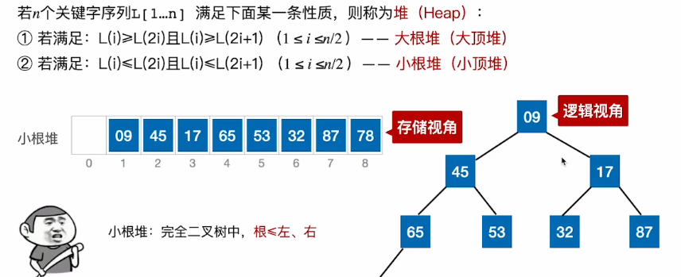

# 堆排序（以选择排序为基础）

​		对一个使用堆来进行存储的序列，进行选择排序会变得十分简单，因此可以考虑将一个待排序序列转换为堆的结构，然后进行选择排序。


1. ### 堆：可以理解为一棵顺序存储的完全二叉树

   

   **大根堆：**根 >= 左、右子树

   **小根堆：**根 <= 左、右子树

   

2. ### 建立大根堆：

   在顺序存储的完全二叉树中，非终端结点的编号 i <= n/2向下取整。

   - 结点i的左孩子 —— 2i

   - 结点i的右孩子 —— 2i+1

   - 结点i的父节点 —— i/2向下取整

   - 从**待排序序列一半（i = len/2）**的地方**从后往前找（i--）**，每次检查当前结点是否满足 **根 >= 左、右**，若不满足，则将当前结点与最大的一个孩子互换；

   - 若交换元素后破坏了下一级的堆，则采用相同的方式继续向下调整（使小元素“下坠”）。

     ```c++
     
     ```

     

3. ### 如何基于大根堆进行排序：

   - 在对一个待排序序列建立完大根堆后，每一趟都将堆顶元素加入有序序列（堆顶元素与待排序序列的最后一个元素互换位置）；

   - 交换完为止后，将待排序序列再次调整为大根堆（使最小元素不断下坠）；

   - 完成**n-1趟**处理后，会将序列变为一个**递增序列**。

     

4. ### 算法效率分析：

   - **分析调整大根堆的函数HeapAdjust()：**一个结点，每下坠一层，就需要**比较2次关键字**。若树高h，某结点在第i层，则最多只需要向下”下坠“**h-i层**，关键字对比**不超过2(h-i)次**。
   - **建堆过程中，时间复杂度为：**O(n)
   - **每进行一趟排序，时间复杂度不会超过：**O(h) = O(log~2~n)
   - **总共时间复杂度：**O(nlog~2~n)
   - **空间复杂度：**O(1)
   - 堆排序**不是稳定的**


# 堆的插入和删除

1. ### 堆的插入：

   对于一个小根堆来说，将**新元素放到表尾**，并与它的**父节点（i/2向下取整）**进行对比，若新元素比父节点更小，则将二者进行互换，新元素一路**”上升“**，直到无法继续上升为止。

   

2. ### 堆的删除：

   还是以小根堆为例，假如删除了其中一个元素，那么用**堆底元素**（存储序列中的最后一个元素）来**替代删除后的空位**，并且让该元素**不断”下坠“**，直到无法下坠为止。


3. ### 考点：

   - 使用插入删除元素时，关键字的对比次数。
   - **下坠：**若下方有**两个孩子**，则需要对比两次关键字，若只有**一个孩子**，那么只需要对比一次。
   - **上升：**每次上升只需要对比一次关键字。