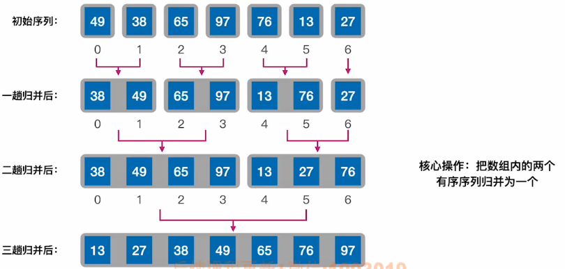
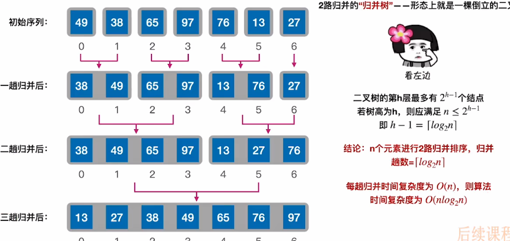

# 归并排序

1. ### 二路归并：

   每次选出一个最小元素放到合并后的数组中，每选一次需要对比关键字1次。

   

   **推论：**m路归并，每次选出一个元素需要对比关键字m-1次

   

   

2. ### 代码实现：

   ```c++
   
   ```

   

3. ### 算法效率分析：

​		

- 空间复杂度 = O(n)，来自于辅助数组B，暂时不考虑递归所占用的空间；
- 归并排序是**稳定的**。

