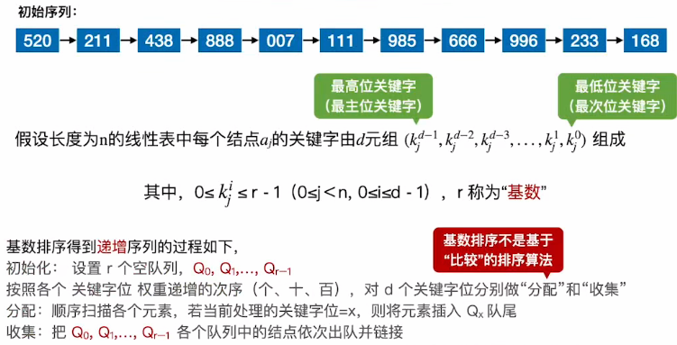
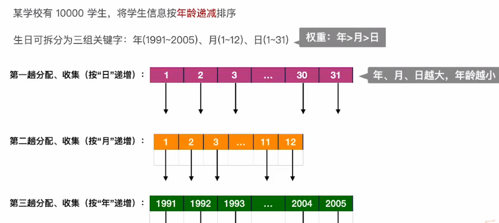

# 基数排序

### 算法效率分析：

1. **空间复杂度：**需要r个辅助队列，O(r)；
2. **时间复杂度：**一趟分配O(n)，一趟收集O(r)，总共需要d（d为把每个关键字拆成d个部分，如100 = 1，0，0）趟分配、收集，总的时间复杂度 = O(d*(n+r))；
3. 算法是**稳定**的。

### 基数排序的应用：

时间复杂度 = O(d*(n+r)) = O(3 * (10000 + 31)) ≈ O(30000)

### 基数排序善于解决的问题：

