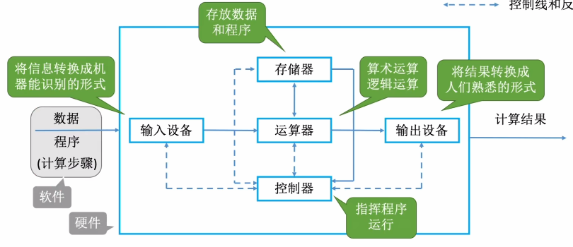
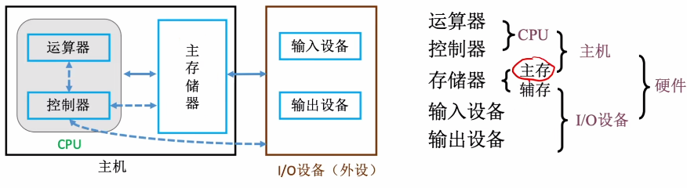

# 早期冯诺依曼机

1. ### 存储程序：

   **将指令以二进制代码的形式事先输入计算机的主存储器**，然后按其在存储器的首地址执行程序的指令。

   

2. ### 结构：

   

   计算机系统中，**软件**和**硬件**在逻辑上是**等效的**。

   

3. ### 冯诺依曼计算机的特点：

   - 计算机由五大部件组成；
   - 指令和数据以同等地位存于存储器，可以按地址寻访；
   - 指令和数据用二进制表示；
   - 指令由**操作码**（指明这条指令进行何种操作）和**地址码**（指明数据存储在什么地址）组成；
   - 存储程序；
   - **以运算器为中心**。

# 现代计算机（以存储器为核心）

1. ### 现代计算机结构：

   

​	**CPU = 运算器 + 控制器**

### 计算机五大结构（主机 = 主存储器 + 运算器 + 控制器）：

- 输入设备
- 输出设备
- 主存储器
- 运算器
- 控制器