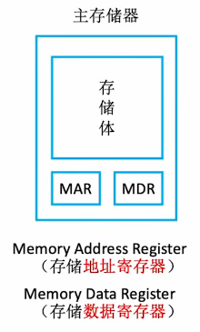
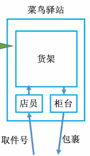
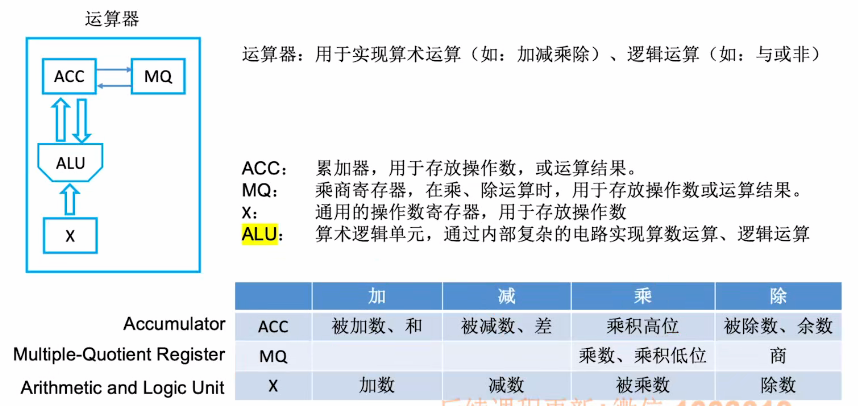
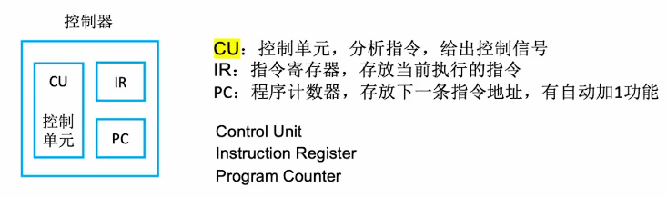
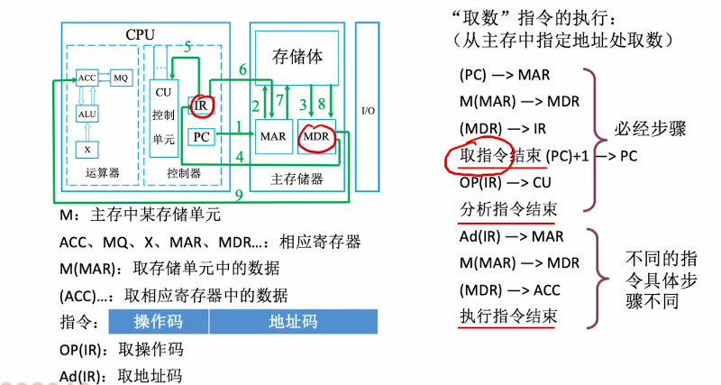

# 主存储器

1. ### 主存储器的基本组成：

                                        

   - **存储体：**数据在存储体内按地址存储；

   - **存储单元：**存储体中包含一个个存储单元（二进制代码），每个存储单元都会包含一个地址信息；

   - **存储字**：存储单元中的二进制组合；

   - **存储字长：**存储单元中二进制代码的位数（通常存储字长为**8bit的整数倍**）；

   - **存储元：**存储二进制的电子元件，一个存储元可以存储1bit。

     

2. ### 考点！！！

   - **MAR的位数反映了存储单元的个数：**MAR=4位 -> 总共有2^4^个存储单元；

   - **MDR位数 = 存储字长：** MDR = 16位 -> 每个存储单元可以存放16bit，即1个字 = 16bit。

     

3. ### 易错！！！

   - 1个字节（Byte）= 8bit

   - 1B = 1个字节 = 8bit，1b = 1个bit

     

4. ### 三种字长：

   - **机器字长：**CPU内部运算器位数和通用寄存器的宽度；
   - **指令字长：**取决于指令的功能和格式，可以是单字长、半字长和双字长；
   - **存储字长：**存储单元的位数，等于MDR的位数

# 运算器

1. ### 运算器的基本组成：

   

   

# 控制器

1. ### 控制器的基本组成：

   

   **完成一条指令的步骤：**

   - 取指令PC
   - 分析指令IR
   - 执行指令CU

# 计算机的工作过程

- 初始：指令、数据存入主存，并且PC指向第一条指令；
- 从主存中取指令放入IR，并且PC自动加1，CU分析指令，CU指挥其他部件执行指令。