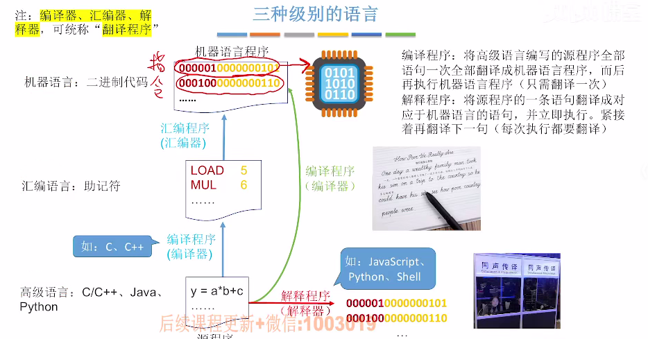

# 系统软件和应用软件

1. ### 应用软件：

   应用软件是为了解决某个应用领域的问题而编制的程序（抖音、qq）。

   

2. ### 系统软件：

   系统软件负责管理硬件资源，并且向上层应用程序提供基础服务（操作系统、数据库管理）。

   

3. ### 语言的三种级别：

   

   

4. ### 软件和硬件的逻辑功能具有等价性：

   同一个功能，既可以用硬件实现（性能高成本高），也能用软件实现（性能低成本低）。

   

5. ### 指令集体系结构ISA：

   软件和硬件之间的界面。