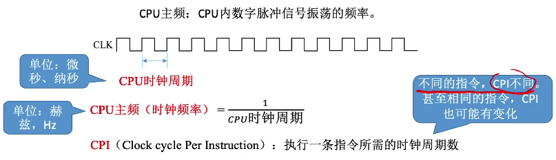
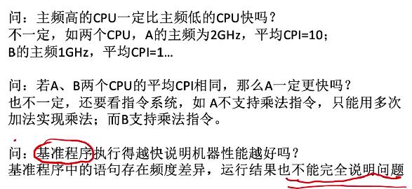

# 存储器的性能指标

1. ### 总容量：

   总容量 = 存储单元个数(MAR) * 存储字长(MDR位数) bit

   ​			 = 存储单元个数 * 存储字长 / 8 Byte

   

   **单位转换：** 2^2^：K，2^20^：M，2^30^：G，2^40^：T

   **数量单位：**K = 10^3^，M = 10^6^，G = 10^9^，T = 10^12^，P = 10^15^，E = 10^18^，Z = ^21^

   ​					**（K -> M -> G -> T -> P -> E -> Z这几个单位以10^3^递增）**

   

2. ### CPU主频：

   

   **执行一条指令的耗时** = CPI * CPU时钟周期

   **CPU执行时间（整个程序的耗时）** = CPU时钟周期数 / 主频 = (指令条数 * CPI) / 主频

   **IPS：**每秒执行多少条指令            IPS = 主频 / 平均CPI

   **FLOPS：**每秒执行多少次浮点运算

   **MIPS：**每秒执行多少百万次计算        MIPS = 主频 / CPI * 10^-6^ = 指令条数 / 时间 * 10^-6^

   

3. ### 数据通路的带宽：数据总线一次所能并行传送信息的位数

4. ### 吞吐量：系统在单位时间内处理请求的数量

5. ### 响应时间：从用户向计算机发送一个请求，到系统对该请求做出响应并获得它所需要的结果的等待时间

   通常包括CPU时间（运行一个程序所花费的时间）与等待时间（用于磁盘存储、存储器访问、I/O操作等时间）

   

6. ### 基准程序（跑分软件）

   

7. ### 思考：

   