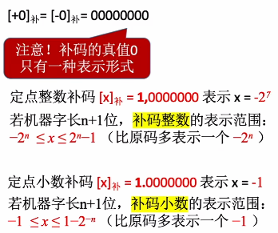

# 定点数 vs 浮点数

**定点数：**小数点的位置固定不变  996.007

**浮点数：**小数点的位置不固定  9.96007 * 10^2^

# 定点数的表示

1. ### 无符号数：

   整个机器字长的全部二进制位均为数值位，没有符号位。

   

   **n位的无符号数表示范围为：**0 ~ 2^n^-1

   

2. ### 有符号数的定点表示：

   

   **尾数：**用于表示定点整数或者定点小数的**数值部分**称为尾数。

   

   

3. ### 原码：

   - 使用尾数来表示**真值的绝对值**，使用符号位**“0 / 1”**来表示**“正 / 负”**；

   

   例：[x]~原~ = 1.1100000 可以看作 -0.11

   - **原码的表示定点整数的范围：**若机器字长为n+1位，那么原码整数的表示范围**-(2^n^-1) <= x <= 2^n^ - 1**（总共2^n+1^-1个数，因为+0和-0表示的是同一个值）；

   - 真值有**+0（0000 0000）**和**-0（1000 0000）**两种表示方式；

   - 使用原码表示定点小数的范围：若机器字长位n+1位，那么原码小数的表示范围-(1-2^-n^) <= X <= 1-2^-n^

     

4. ### 反码：

   若符号位为0，则反码与原码**相同**；

   若符号位为1，则数值位全部**取反**。

   

   若机器字长n+1位，那么反码的整数与小数的表示范围与原码相同。

   

5. ### 补码：

   正数的补码 = 原码

   负数的补码 = 反码末位 + 1

   

   **将补码转换为原码：**补码数值位全部取反并末位+1

   **负数补码判断大小的标准：**数值位部分越小，其绝对值越大，那么就负得越多。

   

6. ### 移码（只能用于表示整数）：

   在补码的基础上将**符号位**取反。

   

   注：超过移码表示范围的数字视为溢出（如8位移码中，128 > 2^7^ - 1 = 127，所以溢出）。

   

7. ### 移码的作用：

   移码表示的整数很方便对比两个数字的大小（从负到正逐渐增大）。

   

   **总结：**原码和反码都有两种真值为0的状态，而补码和移码只有一种真值为0的状态，因此补码和移码可以表示**更多一位负数**。

   

   ​                                        

8. ### 总结：

   