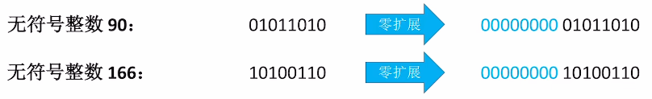
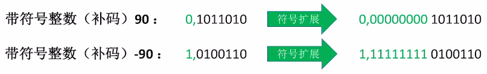

# 为什么要数据扩展？

- ALU的位数是固定的，运算前可能要把短数据扩展为长数据；
- 通用寄存器的位数也是固定的，将数据存入寄存器时，可能需要进行长度扩展；
- 主存内的数据长度不一（将short转换为int），有时需要把端数据扩展为长数据。

# 扩展方式（将8bit扩展为16bit的长数据）

1. ### 零扩展：

   适用于**无符号**整数，使用0对高位进行扩展。

   

   

2. ### 符号扩展：

   适用于**带符号整数（补码）**，用符号位来扩展高位，即将真正的符号位与数值位分开，中间填满8个位置，这些位置**与符号位的数字保持一致**（正的就为0，负的就为1）。

   