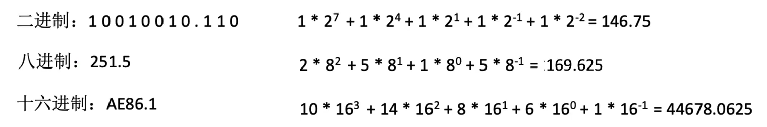
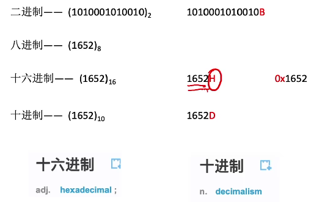
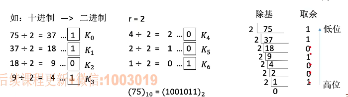
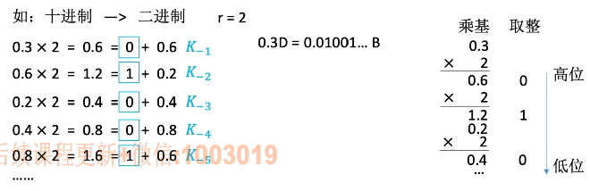
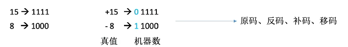

# r进制计数法

基数：每个数码位所用到的不同符号个数，r进制的基数为r。

1. ### 任意进制 -> 十进制：

   

   

2. ### 二进制 <->八进制、十六进制：

   - **二进制 -> 八进制：**

     每3位一组，转化为对应的八进制符号。

   - **二进制 -> 十六进制：**

     每4位一组，转化为对应的十六进制符号。

   - **八进制 -> 二进制：**

     每一位八进制转换为3位对应的二进制。

   - **十六进制 -> 二进制：**

     每一位十六进制转换位4位二进制。

     

3. ### 各种进制的书写方式：

   

4. ### 十进制 -> 任意进制：

   - **十进制 -> 二进制：**

     （1）整数部分（除基取余法）：

     

     （2）小数部分（乘基取整法）：

     

   - **十进制转化为除了二进制以外的其他进制：**

     先将十进制转化为二进制，然后将十进制转化为任意进制。

**注：**有的**十进制小数**无法用二进制精确表示，如：0.3.

5. ### 真值、机器数：

- **真值：**符合人类习惯的数字；

- **机器数：**数字实际存到机器里面的形式，正负号需要被“数字化”。

  