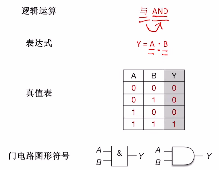
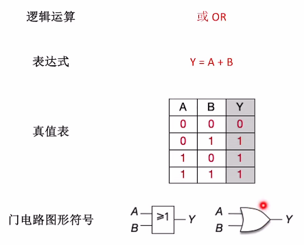
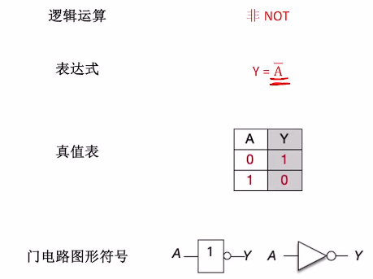
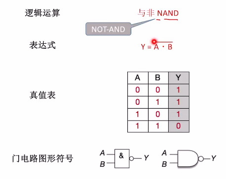
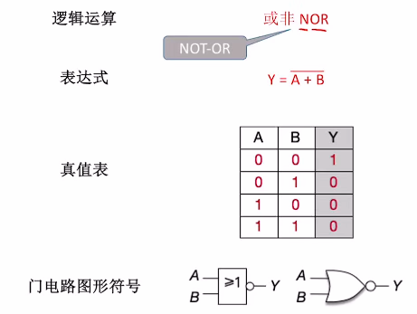
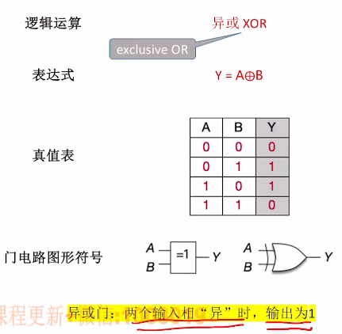
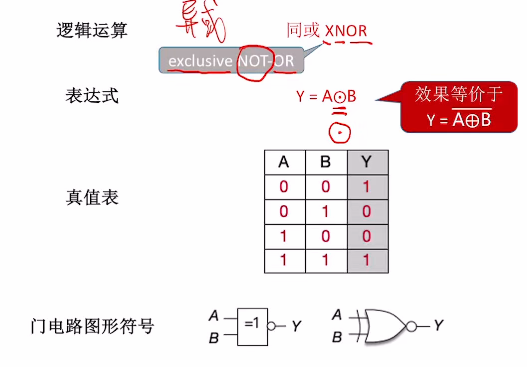
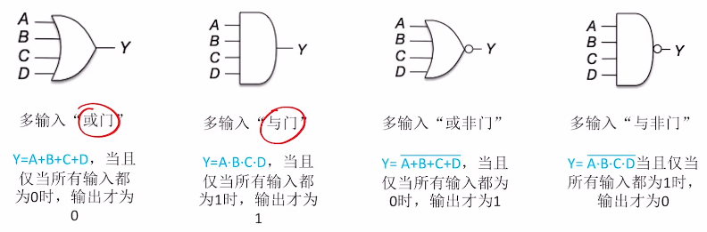

# 基本逻辑运算

1. ### 与（两个同时为真时才为真）：

   

   

2. ### 或（只要有一个为真时就为真）：

   

   

3. ### 非：

   

# 符合逻辑运算

1. ### 与非（相与的结果再取反）：

   

   

2. ### 或非：

   

   

3. ### 异或（当两个输入值相异时，输出为真）：

   

   

4. ### 同或门（异或非门）（当两个输入相同时为真）：

   

   

注意：当奇数个1进行异或时，结果为1；

​			偶数个1进行异或时，结果为0。

5. ### 门电路的变形画法：

   

6. ### 运算优先级：

   非 > 与 > 或

注意：

- 与、或类比乘法和加法；
- 若有括号，先运算括号；
- 非运算优先级最高。