# 加法器

1. ### 加法器的基本功能：

   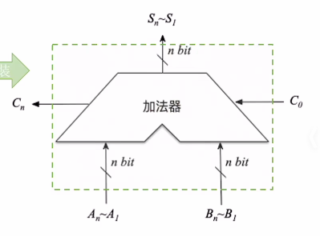

   

2. ### 使用门电路实现一位加法：

   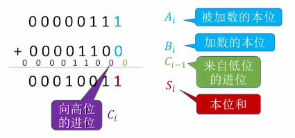

   - **输出本位和：**

     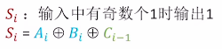

     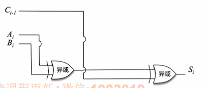

   - **输出是否向高位进位：**

     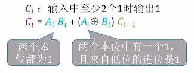

     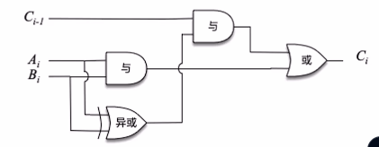

     

3. ### 一位全加器（将上述两个电路合并并且封装）：

   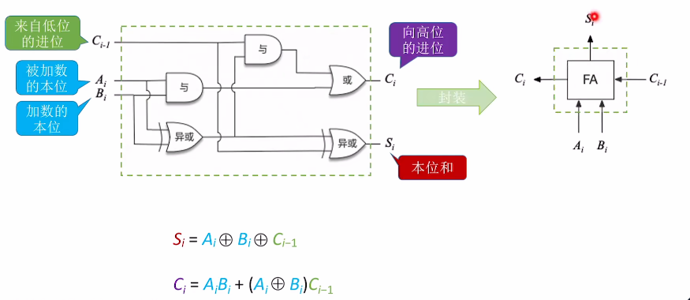

   **n bit加法器：**将n个全加器串联起来，就可以进行两个n bit数的相加（加数和被加数的每一位对应一个全加器的输入）。

   

4. ### 不足之处：

   加法进位的产生是一级一级传递（**串行产生**的，也叫行波进位），位数越多运算速度越慢。

注意：

- 这种加法器属于**并行加法器**，输入端**允许并行输入n bit**；
- 由于进位信息是串行产生的，因此从**“进位方式”**来看，属于**串行进位加法器**；
- 总结：**串行进位的并行加法器**。

5. ### 并行进位的并行加法器：

   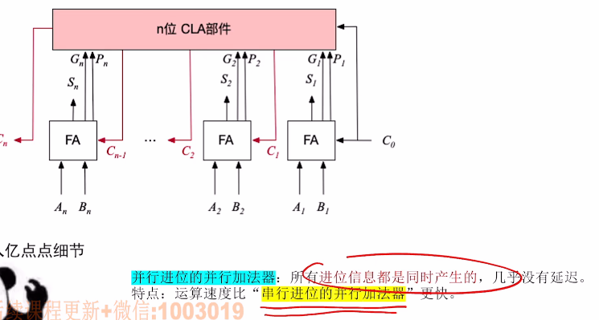

   

   主要关注**加法器的逻辑功能**，串行并行不需要具体考虑。

   

6. ### 带标志位的加法器（判断是否溢出、为0、正/负）：

   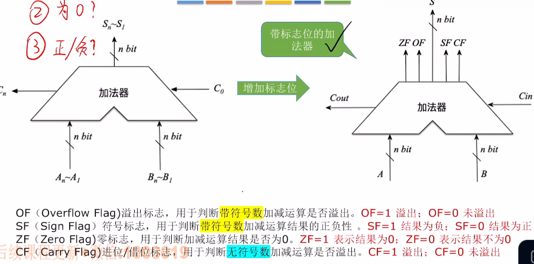

   

7. ### 标志位的生成：

   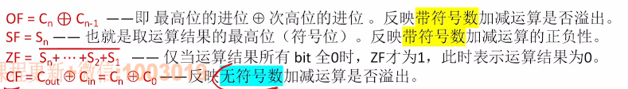

   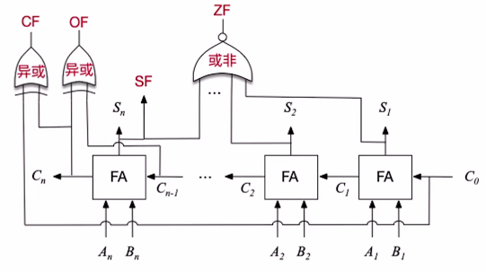

注意：电路图不需要关心，但是逻辑表达式要重点掌握。

