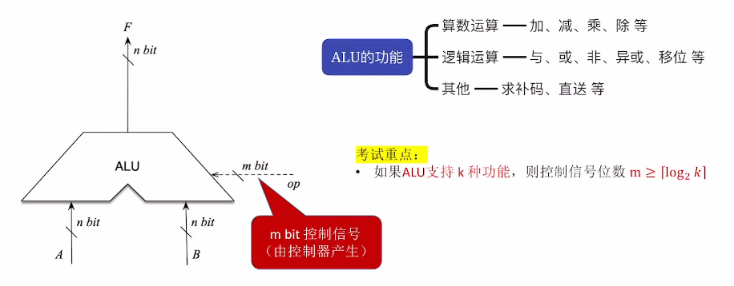
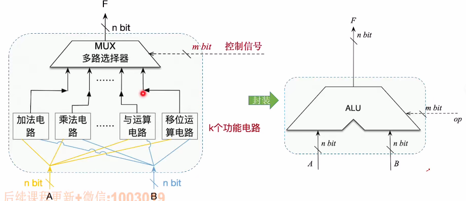
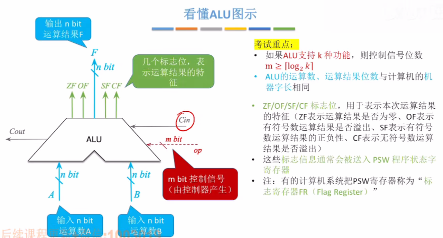

# 算数逻辑单元ALU

​		一种组合逻辑电路，实现了**加 / 减 / 乘 / 除、与 / 或 / 非** 等功能，**ALU是运算器的核心**（CPU由**控制器**和**运算器**构成）。

​		由于加减乘除等运算都要基于“加法”实现，因此**加法器是ALU的核心**。

1. ### ALU的功能：

   

   

2. ### ALU的实现原理（简单了解）：

   使用控制信号来决定到底运行哪一种电路。

   

   

3. ### 看懂ALU的图示：

   

   **注意：**

   - cin为**输入**信号，cout为**输出**信号；
   - **PSW寄存器**也叫**FR寄存器**。

   

4. 