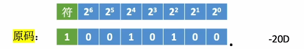
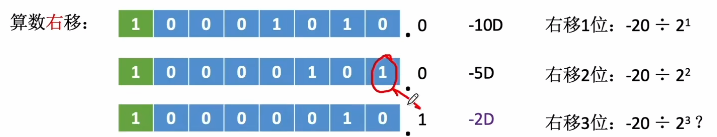
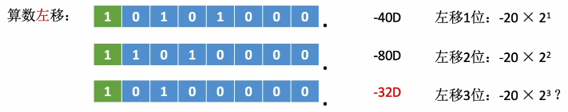
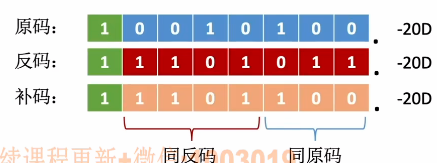
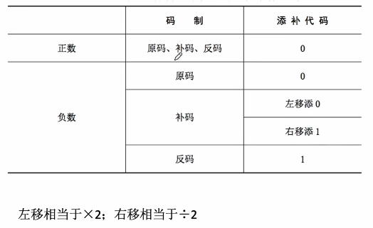
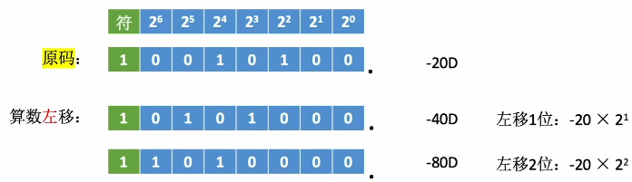
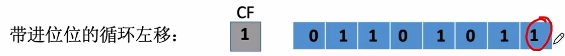

# 算数移位

​		通过改变各个**数码位**和**小数点的相对位置**，从而改变各数码位的**位权**。可以用移位来实现**乘法、除法**。

1. ### 原码的算数移位（定点小数与定点整数同理）：

   

   

   **右移：**高位补0，低位舍弃，若舍弃的位 = 0，则相当于除以2，若舍弃的位≠0，那么就会丢失精度。

   

   

   **左移：**低位补0，高位舍弃，若被舍弃的位 = 0，则相当于*2，若被舍弃的位≠0，那么就会出现**严重误差**。

   

   

2. ### 反码的算数移位：

   **正数：**正数的反码与**原码相同**，因此对正数的反码移位与原码相同。

   - 右移：高位补0，低位舍弃；
   - 左移：低位补0，高位舍弃。

   

   **负数：**负数的反码**数值位与原码相反**，因此负数反码的移位运算规则为

   - 右移：高位补1，低位舍弃；
   - 左移：低位补1，高位舍弃。

   

3. ### 补码的算数移位：

   

   **正数：**正数的补码与原码相同，因此对正数的补码移位也与原码相同。

   - 右移：高位补0，低位舍弃；

   - 左移：低位补0，高位舍弃。

     

   **负数：**负数补码中，最右边的1及其右边的几位与原码相同，而这个1左边与反码相同。

   - 右移**（同反码右移）**：高位补1，低位舍弃；

   - 左移**（同原码左移）**：低位补0，高位舍弃。

     

4. ### 总结：

   

   由于机器字长有限，可能无法准确表达移位。

   

5. ### 算数移位举例：

   

   -20 * 7 = -20 * (2^0^ + 2^1^ + 2^2^) 这几个2的指数分别意为**不左移**、**左移一位**、**左移两位**。

# 逻辑移位（可以看作无符号数的算数移位）

**逻辑右移：**高位补0，低位舍弃；

**逻辑左移：**低位补0，高位舍弃。

# 循环移位

1. ### 规则：

   - **左移：**循环左移就会将高位舍弃的数补充到最低位上；

   - **右移：**循环右移会将最低位舍弃的数补充到最高位上；

     

2. ### 带进位位的循环移位规则：

   

   最高位左边有一个CF位表示加法是否进位，当进行循环移位时：

   - **左移：**左移需要将最高位的数移动到CF位上，而CF位原本的数会补充到最低位；
   - **右移：**右移将会将CF位的数补充到最高位上，而最右边的一位补充到CF位。

注意：由于原码、反码、补码的位数有限，有的时候算数移位不能准确等效于乘法、除法。