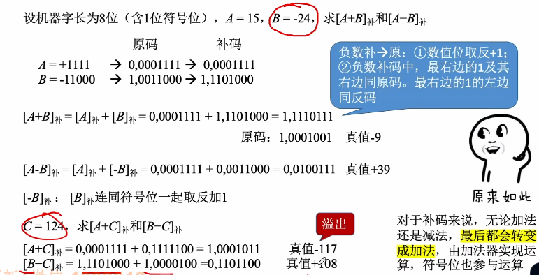
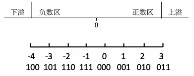
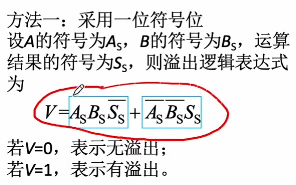
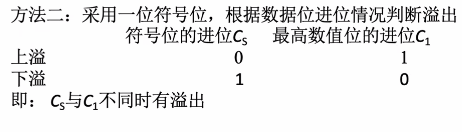
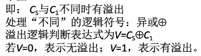
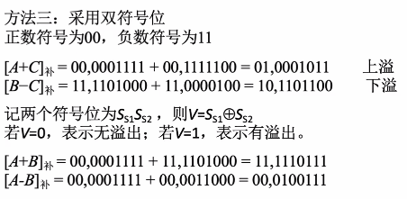

# 原码的加减运算

1. ### 原码的加法运算：

   - **正 + 正：**绝对值做加法，结果为正；
   - **负 + 负：**绝对值做加法，结果为负；
   - **正 + 负：**绝对值大的减去绝对值小的，符号同绝对值大的数；
   - **负 + 正：**大减小，符号同绝对值大的数一致。

   注意：**正 + 正**与**负 + 负**可能会造成**溢出**现象。

2. ### 原码的减法运算（减数符号取反，转变为加法）：

   - **正 - 负：**正 + 正；
   - **负 - 正：**负 + 负；
   - **正 - 正：**正 + 负；
   - **负 + 正：**负 - 负。

# 补码的加减运算（符号位也会参与运算）

带符号数（补码）的减法：

- **“被减数”**不变，**“减数”**全部按位取反，末位+1，使减法变成**”+负数“**；
- 从最低位开始，按位相加，向更高位进位。

1. ### 溢出判断：

   若移位前的符号位与移位后不同，那么就是发生了溢出。

   

   **上溢：**正数 + 正数时可能会发生上溢（正 + 正 = 负）；

   **下溢：**负数 + 负数时可能产生下溢（负 + 负 = 正）。

   

   （1）

   **原理：**只有**正 + 正**和**负 + 负**才会引发溢出，而根据表达式来看，输入和结果不同的话，一定会导致V = 1。

   

   （2）

   **原理：**
   
   - 发生上溢说明原来的符号位是0，而数值位又向符号位进了一位（C~1~ = 1），这样符号位就为1，且不会进位（C~s~ = 0）；
   - 而下溢与上溢相反，由于符号位本身就是1，因此发生下溢会导致符号位向更高位进1（C~s~ = 1）。
   - **总结：**C~s~与C~1~不同时就会发生溢出；
   - 

   （3）

   **注意：**双符号位的补码叫**模4补码**；单符号位叫**模2补码**。
   
   