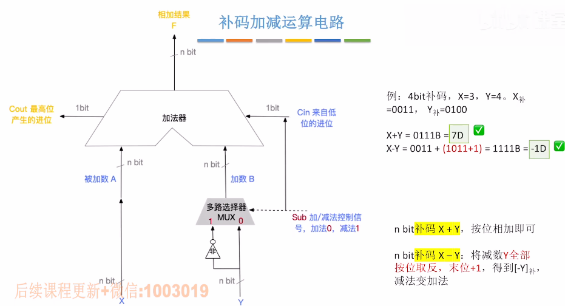
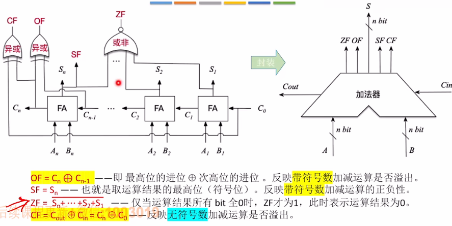

# 补码加减运算电路

注意：

- 当Sub = 1时就会向Cin传递一个进位信号，以此模拟Y的**取反再+1**的操作；
- **无符号数的加减运算**也适用。

### 带标志位的加法器：

- OF溢出标志
- SF判断正负标志
- ZF加减运算结果是否为0标志
- CF判断**无符号数**的加减运算是否溢出

注：CF的原理采用了无符号数加减溢出判断

- 加法：Cin = 0，若Cout = 1（最高位产生进位），那么CF = 1，发生溢出；
- 减法：Cin = 1，若Cout = 0，那么CF = 1，也发生溢出。