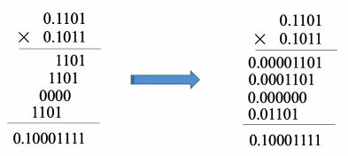
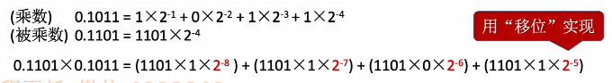
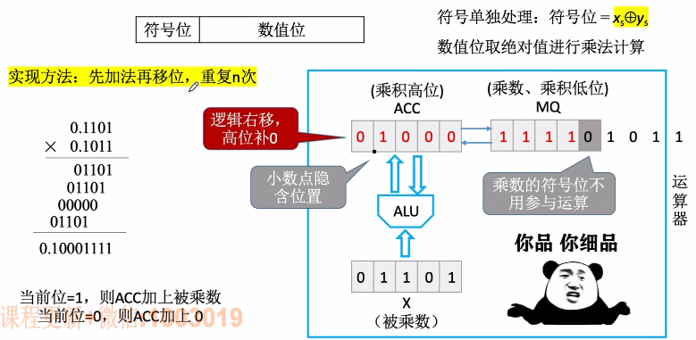
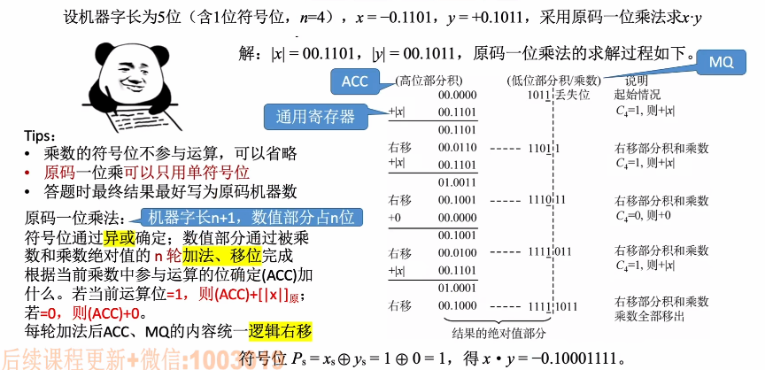

# 原码的乘法运算

1. ### 手算乘法（二进制）：

   

   

   考虑：

   - 实际数字有正负，如何处理符号位；

   - 乘积会使位数扩大一倍，如何处理；

   - 假如要将所有位积保存下来，那么如何统一相加。

     

2. ### 原码一位乘法：

   符号位单独处理：符号位 = 两个乘数的符号位进行异或运算（只有符号不同才为真，不然为假）

   再将数值位取**绝对值**进行乘法计算。

   

   **具体步骤：**

   - 初始时，乘数存储在MQ，被乘数存储在X，ACC全部置为0；

   - 从乘数的最低位开始扫描，若当前位 = 1，则ACC加上被乘数，若当前位 = 0，则ACC加上0（即不作处理）；

   - 每次进行上面的一次加法后，都需要将ACC和MQ加起来逻辑右移；

   - 继续进行上面的操作；

   - 当MQ的最后一位变为之前乘数的符号位时，乘法结束；

   - 最后来单独处理符号，将乘数与被乘数的符号进行异或运算，结果放到ACC的最高位。

     

3. ### 手算模拟过程：

   

   注：整数的乘法与这个类似，只不过乘数最终的符号会固定在MQ最低位的左边，而小数乘法固定在ACC最高位的右边。