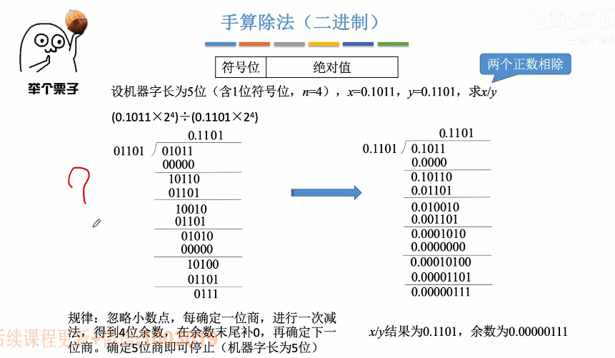

# 原码除法

1. ### 手算模拟原码除法：

   

   

2. ### 使用恢复余数法来模拟原码除法：

   

   **步骤：**

   - 初始时，ACC用于存储被除数和余数，通用寄存器用于存储除数，MQ用于存储商，并且MQ会初始化为全0（MQ的最后一位用于存储当前要确定的一位商）；

   - 由于计算机不会比较除数和被除数哪个更大，因此计算机会**默认先商1**，并将被除数和除数放到ALU中进行减法**（加除数的绝对值取反的补码）**，若相减结果为负数，那么说明商错了，那么就**“恢复余数”**，并且商0，并将结果送回ACC；

   - **减法：**ACC+**[-|y|]~补~** -> ACC

     **恢复余数：**ACC+**[|y|]~补~** -> ACC

   - 完成一轮除法后（确定MQ中最低位的商），ACC与MQ整体**逻辑左移**，ACC高位丢弃，并且MQ低位补0；

   - 当MQ被填满后，结束；

   - 除法结束后，再将符号位单独处理，将除数与被除数的符号位进行异或操作，并且放到商的首位；

   - **注意：**假如机器字长为5位，那么n=4，意思是说总共需要逻辑左移n次，并且商n+1次，但是最后一次商余数不会左移。

     

3. ### 手算模拟恢复余数法：

   

   

4. ### 流程图：

   

   

5. ### 加减交替法（不恢复余数法）（用于优化恢复余数法中被除数小于除数需要恢复余数的情况）：

   若余数为负，**直接商0**，并且让**余数左移1位**并且加上**除数的绝对值**。

   

   

   注意：被除数一定要小于除数，检查方式就是进行除法时第一步的商一定是0。

