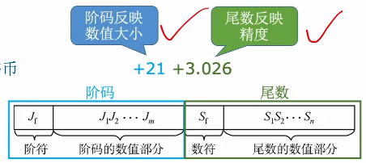
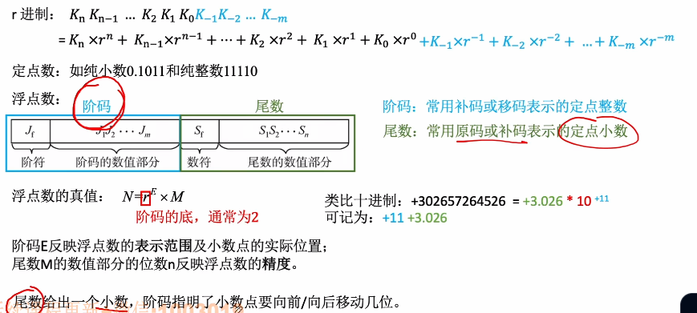
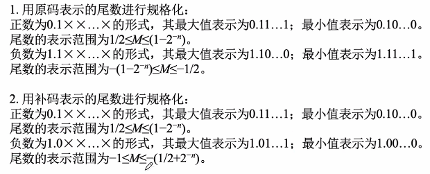
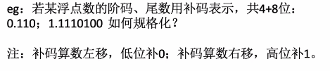

# 浮点数的表示

1. ### 定点数的局限性：

   定点数可以表示的数字范围有限，并且不能无限制增加数据长度。

   

2. ### 使用科学计数法来了解浮点数：

   普通计数法：1314520

   科学计数法：1.31452 * 10^6^ -> +6 +1.31452

   

   

   **规格化的好处：**便于数据在计算机内存储。

   

3. ### 浮点数的表示：

   

   

4. ### 浮点数尾数的规格化：

   - **左规：**当浮点数运算的结果为非规格化时要进行规格化处理，尾数算数左移1位，阶码减1，直到尾数的最高位是有效值；

   - **右规：**当浮点数的运算结果尾数出现溢出时（双符号位位01或10）时，将尾数算数右移一位，阶码加1。

   - **采用双符号位的好处：**当发生溢出时，可以挽救，更高的符号位才是正确的 符号位。

     

5. ### 规格化浮点数的特点：

   

   注意：补码负数的规格化会将数值位的最高位置为0，其余几个都是置为1。

   

   