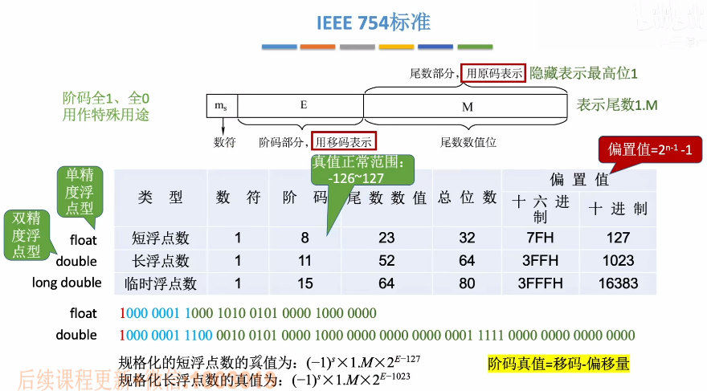
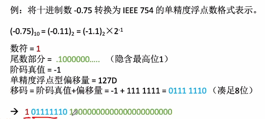
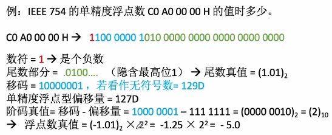
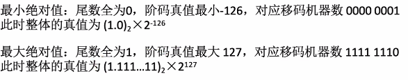
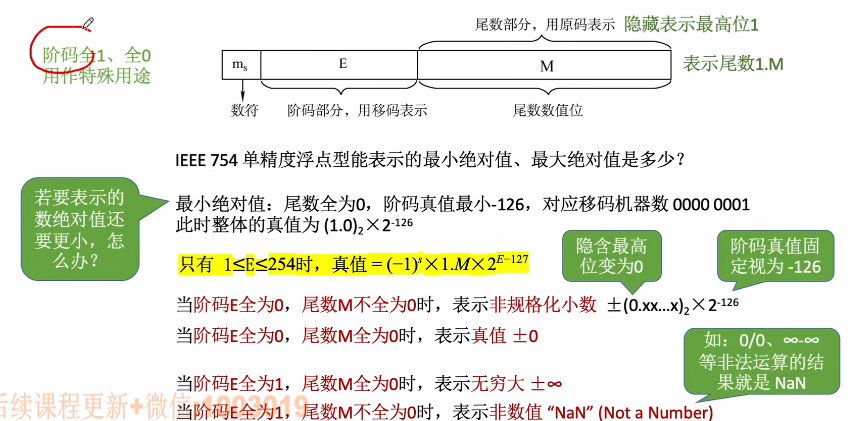
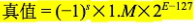

# 移码

1. ### 移码的定义：

   移码 = 真值 + **偏置值**

   八位移码的偏置值 = 128D = 1000 0000B，即**2^n-1^**

   

   **例如：**真值 -127 = -111 1111B

   ​			移码 = -111 1111 + 1000 0000 = 0000 0001 = -127的移码

   

2. ### 将偏置值设置为2^n-1^-1后：

   真值 -128的移码 = 1111 1111；

   真值 -127的移码 = 0000 0000。

   -128（无符号数255）与-127（无符号数0）的移码对应**两种特殊的状态**，其余的从-126 ~ 127的所有真值则代表了无符号数的1 ~ 254，并且呈**真值递增**。

# IEEE754标准 

**将十进制真值转换为偏置值位M的移码（M = 2^n-1^-1）：**

- 十进制真值 + 偏置值M；

- 按“无符号整数”的规则转换为指定的位数；

- float的M = 127，double = 1023。

  

1. ### 十进制转IEEE754的单精度浮点数格式：

   

   

2. ### 将IEEE754转换为十进制：

   

   

3. ### IEEE754表示范围：

   

   **注意：**阶码真值**最小为-126**，是因为-128和-127的移码分别为1111 1111和0000 0000，有其他特殊用途。

   

4. ### 阶码为-128和-127的作用（阶码全0和全1）：

   

   

5. ### 总结（正常情况下IEEE754转换为二进制的方式）：

   - 根据”某浮点数“确定数符、阶码、尾数的分布情况；
   - 确定尾数1.M（最高位的1隐藏）；
   - 确定阶码的真值 = 移码 - 偏置值（方法：移码看作无符号十进制数，用无符号十进制数 - 偏置值）；
   - 