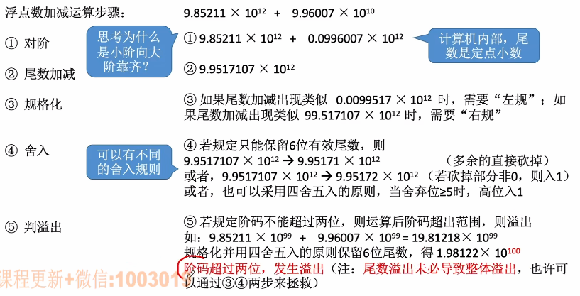
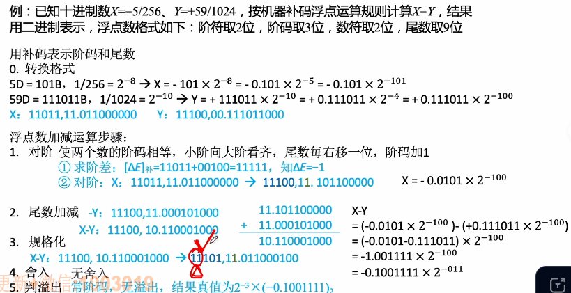
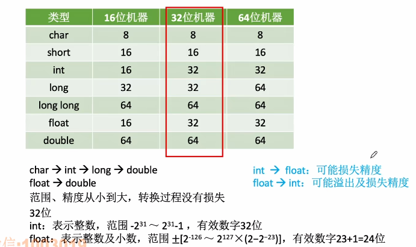

# 浮点数的加减运算（类比科学计数法的加减运算）

1. ### 使用科学计数法进行浮点数的运算：

   

   

2. ### 使用二进制数的浮点数的加减运算：

   

   **注意：**

   - 对阶可能会导致失去末位精度；

   - 使用双符号位表示尾数，这样可以挽救尾数加减发生溢出。

   - 溢出判断：

     阶码上溢：抛出异常；

     阶码下溢：按照机器0来处理。

3. ### 舍入的两种策略：

   - **0舍1入法：**类似四舍五入，即在尾数右移时，被移去的是0就舍去，被移去的是1，就在尾数末位加1（这样做可能会导致继续溢出，那样的话就再进行一次右规）；

   - **恒置1法：**尾数右移时，无论丢掉的最高数值位是1还是0，都会使右移后的尾数末位恒置1；

   - **舍入的出现情况：**对阶、右规格化。

     

4. ### 强制类型转换：

   

   