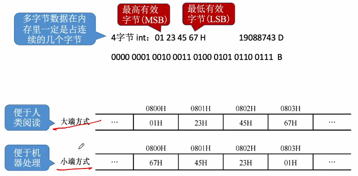
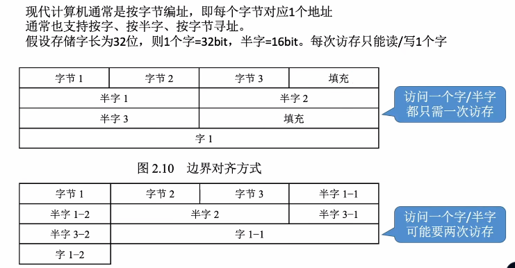

# 数据的存储和排列

1. ### 大小端模式：

   

   

2. ### 边界对齐：

   - **边界对齐：**假如剩下的空间不足以支持下一个数据的存储，那么就对这一行剩下的空间进行**填充**，其余的数据在另一行存储；
   - **边界不对其：**若剩下的空间不足以存储下一个数据，那么就将这个数据的部分内容填充到下一行（**空间利用率高**，但是访问这种类型的数据时**可能需要两次访存**）。

   

   